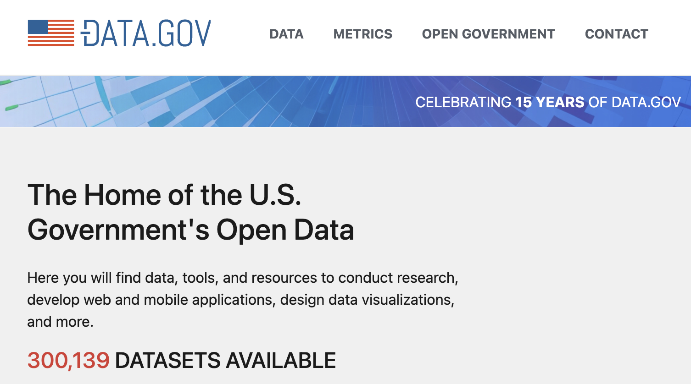

# 30239: Data Visualization for Policy Analysis

## James Turk

---

## Today

- What is the value of data visualization?
- Focus of this course
- Course Logistics

---

<!--
Modern data visualization is largely a product of the sheer amount of data we produce.
-->

---

<!--
In part this is a function of the digitization of most of our lives.

15 years ago there was no data.gov, it has added 300k data sets since then.
-->

---

<!--
As technology advances, our data gets to be incredibly fine grained.
This is a sample of ride share rides over a six year period.  Each pixel is a pick up or drop off.
-->

---

OK, there is **a lot** of data, but isn't that a **good thing**?

---

"What information consumes is rather obvious: it consumes the attention of its recipients. Hence a wealth of information creates a poverty of attention, and a need to allocate that attention efficiently among the overabundance of information sources that might consume it."

~Herb Simon
_as quoted by Hal Varian. Scientific American, September 1995_

---

## What is Visualization?

“... finding the **artificial memory** that best supports our natural means of perception.”
_[Bertin 1967]_

“Transformation of the symbolic into the geometric”
_[McCormick et al. 1987]_

“The use of computer-generated, interactive, visual representations of data to **amplify cognition**.”
_[Card, Mackinlay, & Shneiderman 1999]_

---

## Information Visualization

"The use of computer-generated, interactive, visual representations of (abstract) data to **amplify cognition**."

What does it mean to amplify cognition?

Why do we often seek visualizations?

---

## Why do we create visualizations?

- What visualizations have you created?
- What visualizations have you seen that you remember?

---

## Reasons for Data Visualization

- Means of reasoning about large quantities without reduction/over-simplification.
- Assist in gaining unique insights into data: clustering, correlation, trends, etc.
- Deepen understanding, for ourselves or others.

---

### Four Samples

| x1   | y1    | x2   | y2   | x3   | y3    | x4   | y4    |
| ---- | ----- | ---- | ---- | ---- | ----- | ---- | ----- |
| 10.0 | 8.04  | 10.0 | 9.14 | 10.0 | 7.46  | 8.0  | 6.58  |
| 8.0  | 6.95  | 8.0  | 8.14 | 8.0  | 6.77  | 8.0  | 5.76  |
| 13.0 | 7.58  | 13.0 | 8.74 | 13.0 | 12.74 | 8.0  | 7.71  |
| 9.0  | 8.81  | 9.0  | 8.77 | 9.0  | 7.11  | 8.0  | 8.84  |
| 11.0 | 8.33  | 11.0 | 9.26 | 11.0 | 7.81  | 8.0  | 8.47  |
| 14.0 | 9.96  | 14.0 | 8.10 | 14.0 | 8.84  | 8.0  | 7.04  |
| 6.0  | 7.24  | 6.0  | 6.13 | 6.0  | 6.08  | 8.0  | 5.25  |
| 4.0  | 4.26  | 4.0  | 3.10 | 4.0  | 5.39  | 19.0 | 12.50 |
| 12.0 | 10.84 | 12.0 | 9.13 | 12.0 | 8.15  | 8.0  | 5.56  |
| 7.0  | 4.82  | 7.0  | 7.26 | 7.0  | 6.42  | 8.0  | 7.91  |
| 5.0  | 5.68  | 5.0  | 4.74 | 5.0  | 5.73  | 8.0  | 6.89  |

What sense can we make of this?

---

|                         | Sample 1          | Sample 2          | Sample 3          | Sample 4          |
| ----------------------- | ----------------- | ----------------- | ----------------- | ----------------- |
| Mean of x               | 9                 | 9                 | 9                 | 9                 |
| Variance of x           | 11                | 11                | 11                | 11                |
| Mean of y               | 7.50              | 7.50              | 7.50              | 7.50              |
| Variance of y (±0.003 ) | 4.125             | 4.125             | 4.125             | 4.125             |
| Correlation x & y       | 0.816             | 0.816             | 0.816             | 0.816             |
| Linear Regression       | y = 3.00 + 0.500x | y = 3.00 + 0.500x | y = 3.00 + 0.500x | y = 3.00 + 0.500x |
| R² coefficient          | 0.67              | 0.67              | 0.67              | 0.67              |

---

---

Our understanding of the data is enhanced by these visualizations in a way summary statistics won't capture.

What things are easier to see?

---

## Benefits of Visualizing Data

- outliers
- "shape of data"
- clusters
- _intuition_ and _questions_ - "why is it like that?"
- tap into human capacity for pattern recognition
- often easier to test theories or models

_exploratory visualization_

---

## Explanatory Visualization

- Highlight interesting findings
- Tell a story
- Present a thesis
- Persuade
- Support larger story/argument
- Inspire

---

## Visualizations and Policy

Visualizations have an outsized influence on human cognition, we seem to trust images more than words.

This means that visualizations can be used to **persuade**, but also **mislead**.

There does not need to be intention, we can easily deceive ourselves without realizing it.

---

<!-- images from presentation on O-ring temperature anomaly -->

---

<!-- the result -->

---

<!-- Cholera outbreak. London, 1854. John Snow.  -->

---

## Data Visualization for Policy Analysis

---

## Course Goals

- Understand & appreciate what makes a good data visualization.
- Learn practical visualization techniques that will apply in any language & library.
- Build a portfolio of static & interactive visualizations using real-world policy data.
- Gain exposure to useful libraries in Python and JavaScript.

---

## Topics

- Fundamentals, Grammar of Graphics
- Design principles. How to use color, human perception, chart design.
- How to evaluate and critique visualizations.
- Uncertainty & Narrative
- HTML/CSS/JS overview
- D3.js
- Interactive & non-chart data visualization.
- Geospatial visualization
- Special Topics: to be discussed

---

## Programming Workload

Key Idea: You get better at visualizations by making *a lot* of them. (20-30 this quarter)

- Expect to write code every week, mostly fairly short Python functions.
- You will be learning at least one library (Altair) mostly independently.
- You'll also need to be comfortable with `pandas` or `polars`.

### JavaScript and D3

*"You aren't going to make them learn D3 are you?"*

- 1 Assignment
- 1-2 Lectures

Final project will have a place where D3 will be helpful, but other options will be presented.

After introductory lecture, some examples will continue to be in D3, but you will not need to understand their inner workings.

<!--
It has however, become a "library's library" in some ways. Most developers interact with d3 through a higher-level interface. 

We will be learning Altair, which generates Vega JSON, which in turn is drawn using D3.

D3 underpins dozens of other charting libraries as well, and D3's own documentation says:

    D3 makes things possible, not necessarily easy; even simple things that should be easy are often not. To paraphrase Amanda Cox: “Use D3 if you think it’s perfectly normal to write a hundred lines of code for a bar chart.”

Learning D3 both requires working in an unfamiliar environment (JavaScript) and with a very unique style of programming based around their concept of the ["data join"](https://d3js.org/d3-selection/joining), which requires a decent understanding of the HTML Document Object Model.

So, if you are here to learn visualization, I think that it is fair that you can succeed in this class without putting yourself through that.
-->

---

## Course Structure

- **Lecture and Discussion**: Introduce and explore key concepts, mostly focused on theory.
- **Readings**: Supplement course materials with more examples, technical tutorials.
- **2 "minor" assignments: Altair & D3** - Gain practice with commonly used tools in a structured setting.
- **Projects**: Learn to explore a topic on your own from conception to practice. Leave here with a portfolio you can show off.

---

## Course Staff

- James Turk
- TODO

**All official information will be on the course site and/or Ed as appropriate.**

---

## Projects

|                | Static | Interactive |
| -------------- | ------ | ----------- |
| Proposal       | Week 1 | Week 6 | 
| Feedback Draft | Week 3 | Week 8 |
| Peer Critique  | Week 4 | Week 9 | 
| Final          | Week 5 | Week 10 |

## Practice Assignments

- Altair (Week 2)
- D3 (Week 6)

---

## Grading

15 SNU grades

**Completion:** 9 (2x Proposals, Drafts & Critiques + 2 Labs + 1 Participation)

**Quality Grades:** 6 (2x Design, Narrative, Code Quality)

---

## AI Policy

In this course, all usage of generative AI must be *fully cited*.

Details on specific rules: <https://capp30239.netlify.app/policies/ai/>

You are, as always, expected to turn in **your own work**, not the work of an LLM.

---

## Static Visualization Project

<https://capp30239.netlify.app/coursework/static/>

**End Product**

Using real data of your choosing:

- 8-12 distinct images, of at least 5 different types.
- Presented as part of a **narrative**: an article, infographic, poster.
- Cohesive visual design: custom theme for graphs, matching colors and fonts with supplementary material.

Use of Altair is **strongly** recommended, but other libraries allowed.

---

## Examples

<https://capp-30239-winter-2021.netlify.app/#staticShowcase>

---

## Milestones

- Milestone 1 (Week 1): Draft proposal.
- Milestone 2 (Week 3): Draft of 8 visualizations for review & critique.
- Milestone 3 (Week 4): Peer Critique
- Milestone 4 (Week 5): Final Deliverable

---

## Acknowledgements

Thanks to Alex Hale, Andrew McNutt, and Jessica Hullman for sharing their materials.

[Why Is Data Visualization Important? What Is Important in Data Visualization?](https://hdsr.mitpress.mit.edu/pub/zok97i7p/release/4) - An tony Unwin
