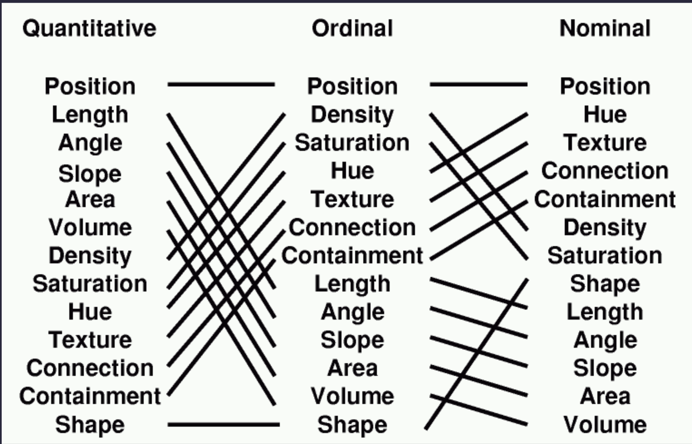
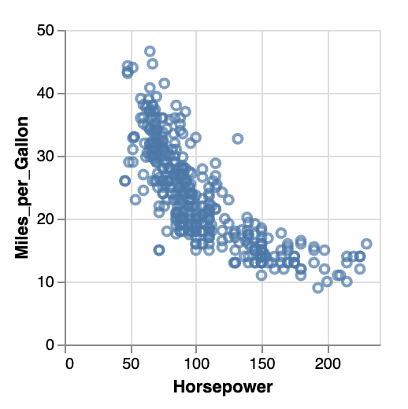

# Grammar of Graphics with Altair

## CAPP 30239

---

## Today

- What is a **grammar of graphics** and how do we use it in practice?
- What **types of data** do we encounter, and how does that affect visualizations?
- Introduction to **Altair**

---

## Grammar of Graphics

Hadley Wickham, creator of `ggplot2` and `tidyverse`, ["A Layered Grammar of Graphics"](http://vita.had.co.nz/papers/layered-grammar.pdf).

Key Idea: move beyond pre-defined composites like "scatter plot" and "bar chart" into a composable grammar from which we can construct a wide variety of visualizations.

---

## Wickham's Components:

1. data and aesthetic mappings,
2. one or more layers, each with

    - a geometric object (line, point, etc.)
    - (optional) statistical transformation
    - (optional) position adjustment

3. one scale per aesthetic mapping (color, size, etc.)
4. a coordinate system
5. facet specification

---

## Types of Data

### **N** - Nominal

"strings" with no **order** (alphabetical does not count)

Species
States
Countries

### **O** - Ordered

- Grades: A, B, C, D, E, F
- Rankings: 1st, 2nd, 3rd

---

## Types of Data (Quantitative)

### **Q** - Interval (arbitrary zero)

- Dates (1 CE, Jan 1 1970, or...)
- Location (lat, lon)

Only differences matter, can't compare ratios.
_(What is 2024 / 1990?)_

### **T**emporal

Some systems (like Altair) will also offer this option specifically for dates and times.

### **Q** - Ratio (zero fixed)

Physical measurements, counts, amounts.

"4 km is _twice as far_ as 2 km"

---

## Types of Data (Operations)

|          | =, != | <, >, <=, >= | +, - | ÷   |
| -------- | ----- | ------------ | ---- | --- |
| Nominal  | ✓     |              |      |     |
| Ordered  | ✓     | ✓            |      |     |
| Interval | ✓     | ✓            | ✓    |     |
| Ratio    | ✓     | ✓            | ✓    | ✓   |

---

## Data Model to N, O, Q

- string?
- bool?
- float/int?

Possible exceptions?

---

## Data Model to N, O, Q

_Typically:_

- string - nominal or ordered
- bool - nominal
- float/int - interval or ratio

Possible Exceptions?

- Numeric IDs
- ZIP Codes
- ratio data stored with units (e.g. "10km")

---

## Mapping of Variables to Aesthetics

- position (X, Y, Z)
- length
- angle
- slope
- area
- volume
- density
- hue
- saturation
- texture
- connection
- containment/grouping
- shape

---

### Mackinlay's "effectiveness"



---

## Altair

Altair is a Python visualization library that allows us to work from a grammar of graphics perspective.

It also is very flexible in output formats, which will be useful if you want to modify your graphics or make them interactive.

Altair is built on top of **Vega-Lite**.

Vega-Lite is a system that represents graphics in a JSON schema, and a set of tools that convert these JSON representations to images or interactive graphics.

---

## Vega-Lite Example

```json
{
  "$schema": "https://vega.github.io/schema/vega-lite/v5.json",
  "description": "A scatterplot showing horsepower and miles per gallons for various cars.",
  "data": {"url": "data/cars.json"},
  "mark": "point",
  "encoding": {
    "x": {"field": "Horsepower", "type": "quantitative"},
    "y": {"field": "Miles_per_Gallon", "type": "quantitative"}
  }
}
```
Vega condenses several of the different pieces of the grammar to _"encoding channels"_.

---



---

## Altair

```python
import pandas as pd
import altair as alt

df = pd.read_csv("cars.csv")
alt.Chart(df).encode(
  x="Horsepower:Q",        # shorthand for simple features
  alt.Y("Miles_per_Gallon:Q").title("Miles Per Gallon"),  # longer form w/ customization
)
```

Altair is a Pythonic wrapper to create Vega-Lite JSON.  If you use it in a notebook, the resulting graphs will render inline.


---

## Altair Notebook

<!-- at this point, see the marimo notebook in this directory -->

--- 

## Learning Altair

To master a library like Altair, you'll go through the following phases:

1. Learn the key concepts.
    - Goal: Understand how the authors of Altair think about visualization.
    - Achieved by: Reading user guide & watching tutorials.
2. Internalize concepts & API.
    - Goal: Be able to do common tasks without referring to documentation. (You'll always lean on documentation for specifics.)
    - Achieved by: Working on assignments & experimentation. Reading API reference as needed.
3. Mastery (not this quarter!)
    - Goal: Be able to manipulate library to achieve most tasks. Understand limits.
    - Achieved by: Regular use over months/years. Reading API reference and/or source code.

---

## Altair Assignment

<!-- walk through of assignment setup & how it'll be graded -->
