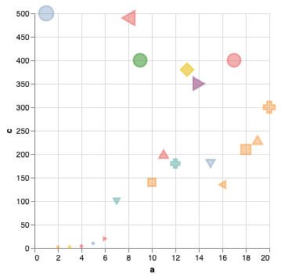
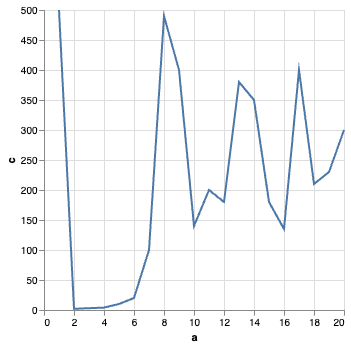

# Perception & Color

## CAPP 30239

---

## Today

- What matters most when creating a visualization?
- How does human **perception** factor into visualization design?
- Understanding **color**, and computational representations of it.

---

## What is the most important question when creating a visualization?

---

## What is the most important question when creating a visualization?

<ul>
<li><s>Where will the data come from?</s>
<li><s>What type of chart do I use?</s></li>
<li>Who is the audience?</li>
</ul>

---

## Audience First

- Who are you presenting to?
- How familiar are they with the data?
- What is their numerical & visualization literacy?
- Via what medium will they receive the information?
- What are you trying to do? (Persuade, Inform, Inspire?)

*Only now can we start thinking about data and presentation.*

---

## Perception

- **Selective** - We can only pay attention to so much.
- **Patterns** - Our brains are pattern-matching machines, audience will benefit from intentional patterns & be distracted by unintentional ones.
- **Limited working memory** - We hold a very limited set of information in our minds at once.

---

## What do you see?

<div class="container">
<div class="col">



</div><div class="col">

```python
alt.Chart(random_df).mark_point().encode(
    alt.X("a"),
    alt.Y("c"),
    alt.Color("b"),
    alt.Size("c"),
    alt.Shape("a:N"),
    alt.Fill("b"),
    alt.Opacity("b"),
) 
```
</div>
</div>

---

## What do you see?

<div class="container">
<div class="col">



```
alt.Chart(random_df).mark_line().encode(
    x="a",
    y="c",
)`
```

</div>
</div>

---

## Effectiveness Revisited


---

<div class="container">

<div class="col">

**Altair Channels**

- Position (`X, Y`)
- Angle (`Angle`)
- Area (`Radius`, `Size`)
- Hue, Saturation (`Color`)
- Texture (`Opacity`, `Fill`)
- Shape (mark type, `Shape`)
</div>

<div class="col">

**What about?**
- Length
- Slope
- Volume
- Density
- Connection
- Containment
</div>
</div>

---

**Derived Properties**


- Length/Area - size of bars (`X`, `Y`)
- Slope & Density - affected by scale
- Connection - ex. layering of lines w/ points
- Containment - achieved with layering

What about *volume*?

---

## Stevens' Power Law

Stevens (1975): Human response to sensory stimulus is characterized by a power law with different exponents with different stimuli. 

perception = (magnitude of sensation)<sup>a</sup>

Smaller <sup>a</sup> exponent: harder to perceive changes.

Stevens measured values of a by exposing people to varied stimulus and asking them to compare magnitudes.

---


<div class="container"><div class="col">


</div><div class="col">


| Continuum | Exponent |
|-|-|
| Color Brightness| 0.33-0.5 |
| Smell| 0.6 |
| Loudness | 0.67 |
| **Depth Perception** | 0.67 | 
| Area | 0.7 |
| 2D Planar Position | 1.0 |
| Warmth | 1.3-1.6 |
| Color Saturation | 1.7 |
| Electric Shock | 3.5 |

</div></div>

---

## 3D Graphs


---


---


---

## Instead of 3D Graphs

- Find other channels: hue & size are good candidates.
- Combine different dimensions into side-by-side 2D graphs.

TODO: example of 2D decomposition of a graph

---

## What is Color?

Wavelengths of light are perceived as particular colors:


In practice: we almost never see monochromatic color, light sources emit a spectrum & we perceive peaks.

<!-- credit: https://en.wikipedia.org/wiki/File:Linear_visible_spectrum.svg -->

---

## Color & the Eye

### Rods

- "brightness" 
- spread throughout retina
- more sensitive in low light conditions

### Cones

- 3 types with peak sensitivity at different frequencies
- concentrated in center of eye
- less sensitive in low light conditions


<!-- source https://commons.wikimedia.org/wiki/File:Cone-fundamentals-with-srgb-spectrum.svg -->

---

## Metamers ...

TODO: slides from Alex maybe? or drop?

---

## Color Naming

---

## Color Models

- CIE
- RGB
- HS(V|L|B)


---

## Color Channels & Data Types

TODO: https://docs.google.com/presentation/d/1avOsobdcsTG6qaDVCSesIOBFcfxjH12d/edit#slide=id.p27
TODO: (also 33 and 34)

---

## Back to Visualization

### Uses of Color 
Identify, Group, Layer, Highlight

### Types of Palettes

- qualitative
- sequential
- diverging

### Hue Separation

- distinct
- grouped

---

## "Get it right in black & white"

---

## Legibility

---

## Cultural Considerations

---

## Human Variation

---

## What about "alpha"?

You will often see a fourth channel: RGB**A**, HSL**A**.

This is known as alpha transparency (translucency).

This has to do with how the program in question *blends* the colors.

By default, the second color drawn overdraws the first.

With translucency we can get a sense of depth without resorting to 3D.

- Use sparingly.
- Variations are very subtle, and background dependent.

TODO: example

---

## Tools

---

## Acknowledgements & References

Thanks to Alex Hale, Andrew McNutt, and Jessica Hullman for sharing their materials.

- https://www.math.csi.cuny.edu/~mvj/GC-DataViz-S23/lectures/L6.html
- https://en.wikipedia.org/wiki/Stevens%27s_power_law
- https://colorusage.arc.nasa.gov
- https://jamie-wong.com/post/color/ (great if you'd like to go deeper)
