# Perception & Color

## CAPP 30239

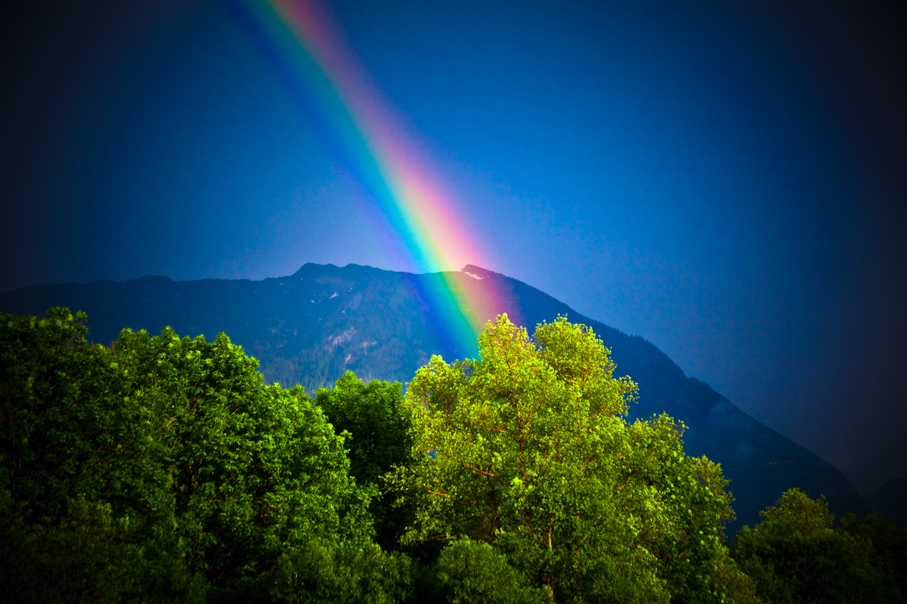
<!-- photo CC-By https://flickr.com/photos/andreaskrispler/4651412740/ -->

---

## Today

- What matters most when creating a visualization?
- How does human **perception** factor into visualization design?
- Understanding **color**, and computational representations of it.

---

## What is the most important question when creating a visualization?

---

## What is the most important question when creating a visualization?

<ul>
<li><s>Where will the data come from?</s>
<li><s>What type of chart do I use?</s></li>
<li>Who is the audience?</li>
</ul>

---

## Audience First

- Who are you presenting to?
- How familiar are they with the data?
- What is their numerical & visualization literacy?
- Via what medium will they receive the information?
- What are you trying to do? (Persuade, Inform, Inspire?)

*Only now can we start thinking about data and presentation.*

---

## Perception

- **Selective** - We can only pay attention to so much.
- **Patterns** - Our brains are pattern-matching machines, audience will benefit from intentional patterns & be distracted by unintentional ones.
- **Limited working memory** - We hold a very limited set of information in our minds at once.

---

## What do you see?

<div class="container">
<div class="col">

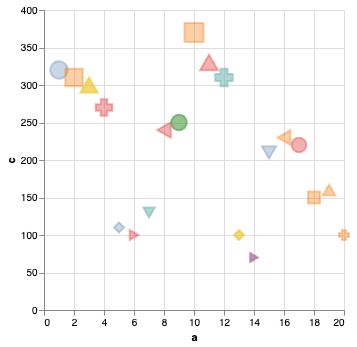

</div><div class="col">

```python
alt.Chart(random_df).mark_point().encode(
    alt.X("a"),
    alt.Y("c"),
    alt.Color("b"),
    alt.Size("c"),
    alt.Shape("a:N"),
    alt.Fill("b"),
    alt.Opacity("b"),
) 
```
</div>
</div>

---

## What do you see?

<div class="container">
<div class="col">

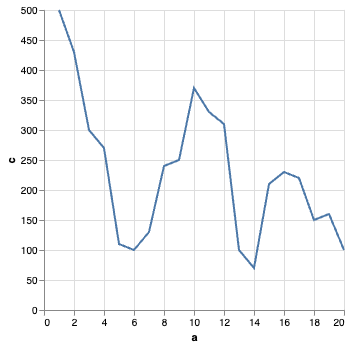

```
alt.Chart(random_df).mark_line().encode(
    x="a",
    y="c",
)`
```

</div>
</div>

---

## Effectiveness Revisited

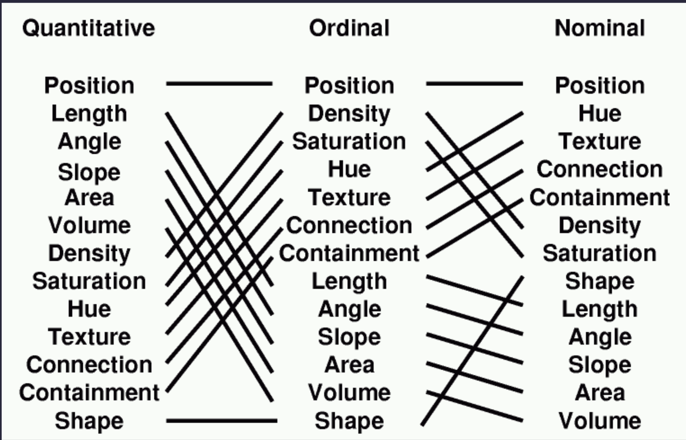

---

<div class="container">

<div class="col">

**Altair Channels**

- Position (`X, Y`)
- Angle (`Angle`)
- Area (`Radius`, `Size`)
- Hue, Saturation (`Color`)
- Texture (`Opacity`, `Fill`)
- Shape (mark type, `Shape`)
</div>

<div class="col">

**What about?**
- Length
- Slope
- Volume
- Density
- Connection
- Containment
</div>
</div>

---

**Derived Properties**


- Length/Area - size of bars (`X`, `Y`)
- Slope & Density - affected by scale
- Connection - ex. layering of lines w/ points
- Containment - achieved with layering

What about *volume*?

---

## Stevens' Power Law

Stevens (1975): Human response to sensory stimulus is characterized by a power law with different exponents with different stimuli. 

perception = (magnitude of sensation)<sup>a</sup>

Smaller <sup>a</sup> exponent: harder to perceive changes.

Stevens measured values of a by exposing people to varied stimulus and asking them to compare magnitudes.

---


<div class="container"><div class="col">

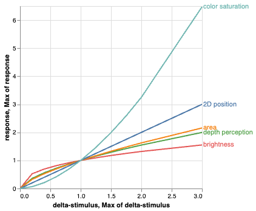

</div><div class="col">


| Continuum | Exponent |
|-|-|
| Color **Brightness**| 0.33-0.5 |
| Smell| 0.6 |
| Loudness | 0.67 |
| **Depth Perception** | 0.67 | 
| Area | 0.7 |
| 2D Planar Position | 1.0 |
| Warmth | 1.3-1.6 |
| Color **Saturation** | 1.7 |
| Electric Shock | 3.5 |

</div></div>

---

## 3D Graphs

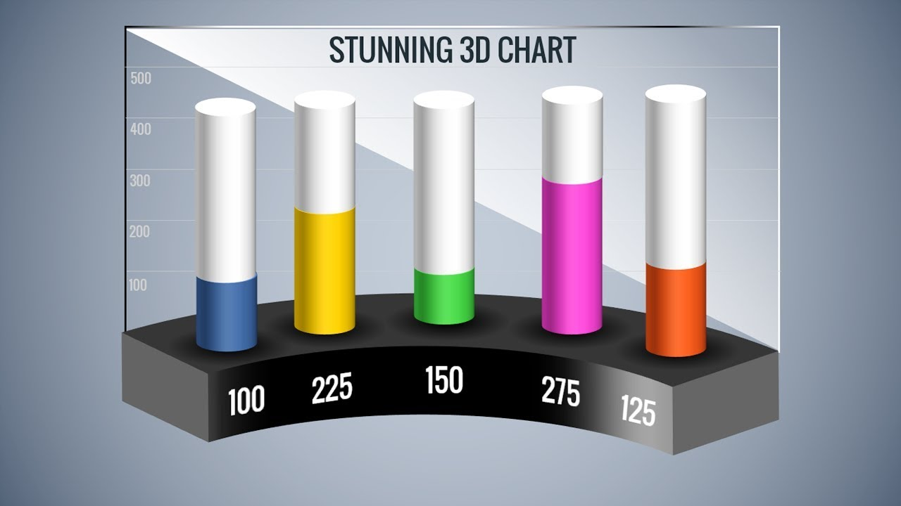

---

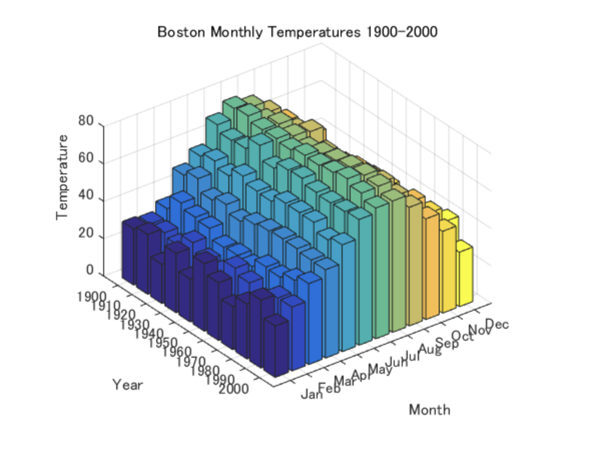

---

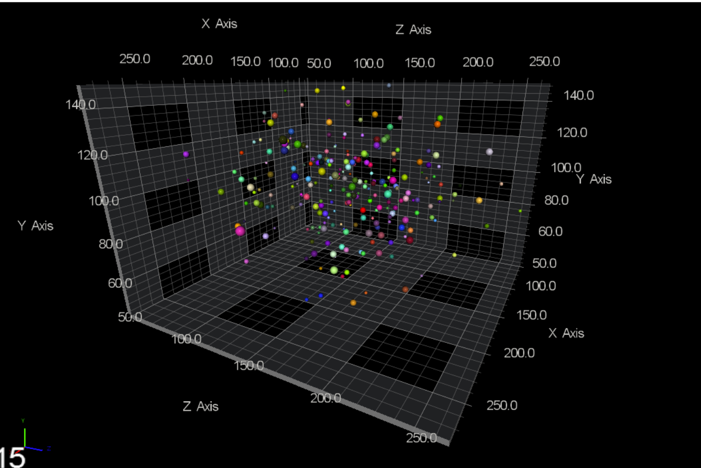

---

## Instead of 3D Graphs

- Find other channels: hue & size are good candidates. (bubble chart)
- Or make multiple 2D graphs with XY/YZ/XZ pairs.

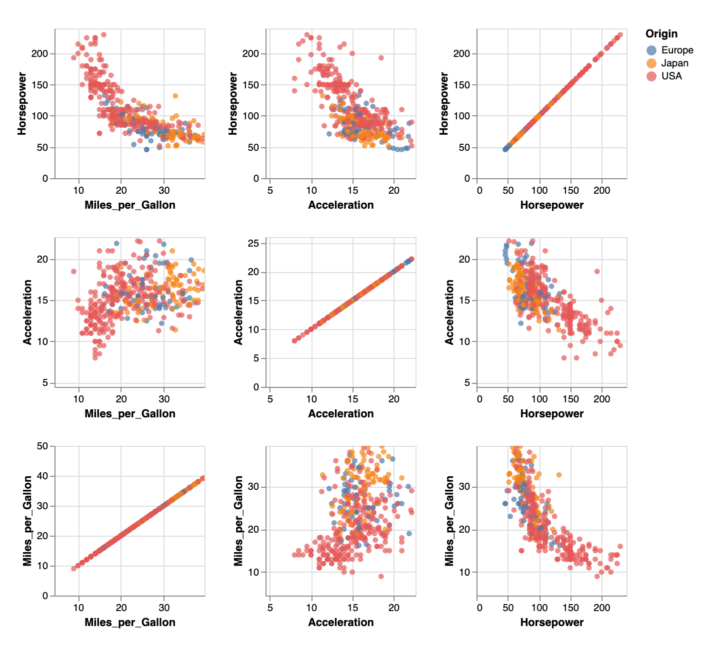

---

## What is Color?

Wavelengths of light are perceived as particular colors:


What's missing?

<!-- credit: https://en.wikipedia.org/wiki/File:Linear_visible_spectrum.svg -->

---

## Color & the Eye

### Rods

- spread throughout retina
- more sensitive in low light conditions
- brightness ("lightness")

### Cones

- 3 types with peak sensitivity at different frequencies
- concentrated in center of eye
- less sensitive in low light conditions
- hue & saturation

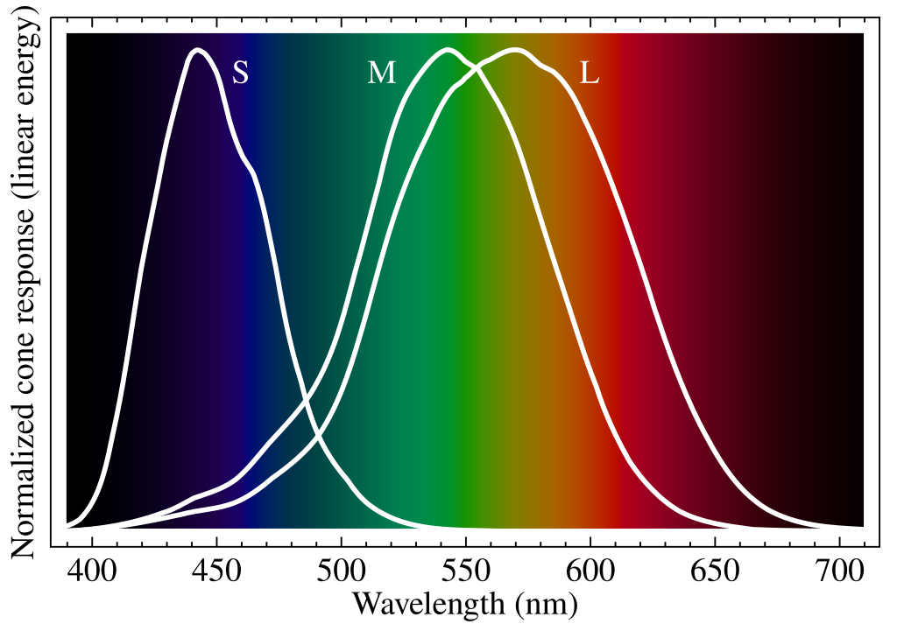

<!-- source https://commons.wikimedia.org/wiki/File:Cone-fundamentals-with-srgb-spectrum.svg -->

---

## Spectrum vs. What We See

What we actually see is always a blend of multiple peaks.

This is impacted by ambient light conditions, as well as quirks of our visual processing.

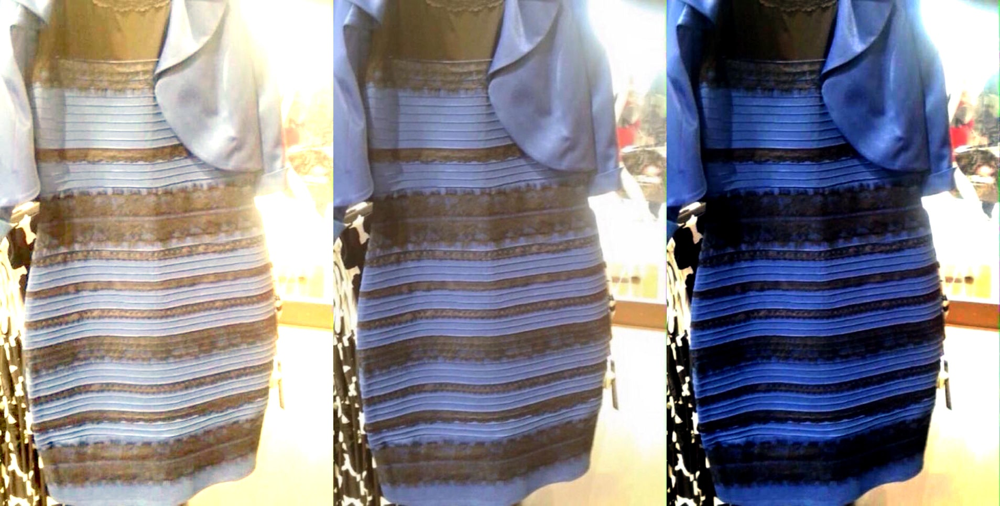

In actuality, multiple combinations of light can give same color (**metamers**).

---

## Chromatic Adaptation

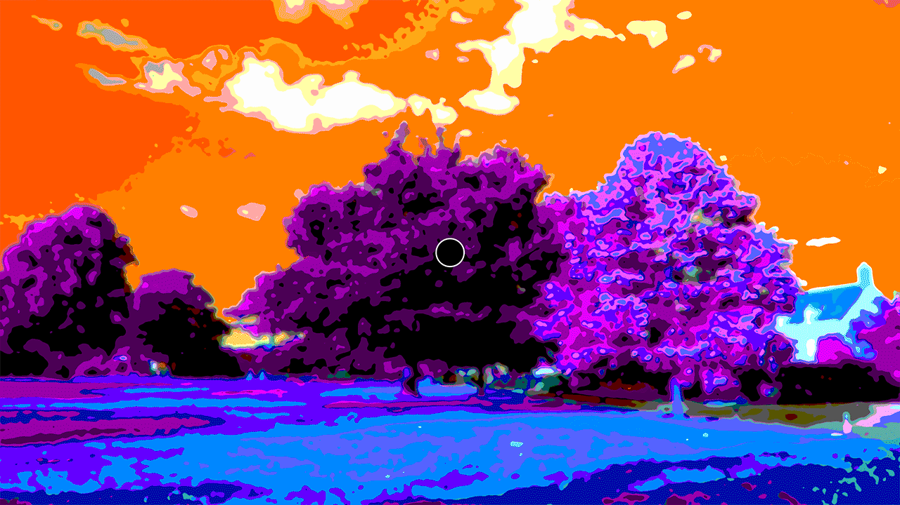

Source: Andrew Steele <https://www.youtube.com/channel/UC-XYsDNh4-886rMNLnnwR_w>

---

## Color Naming

Color naming is highly subjective, and research has shown that the ability to name a color correlates highly with the ability to distinguish it.

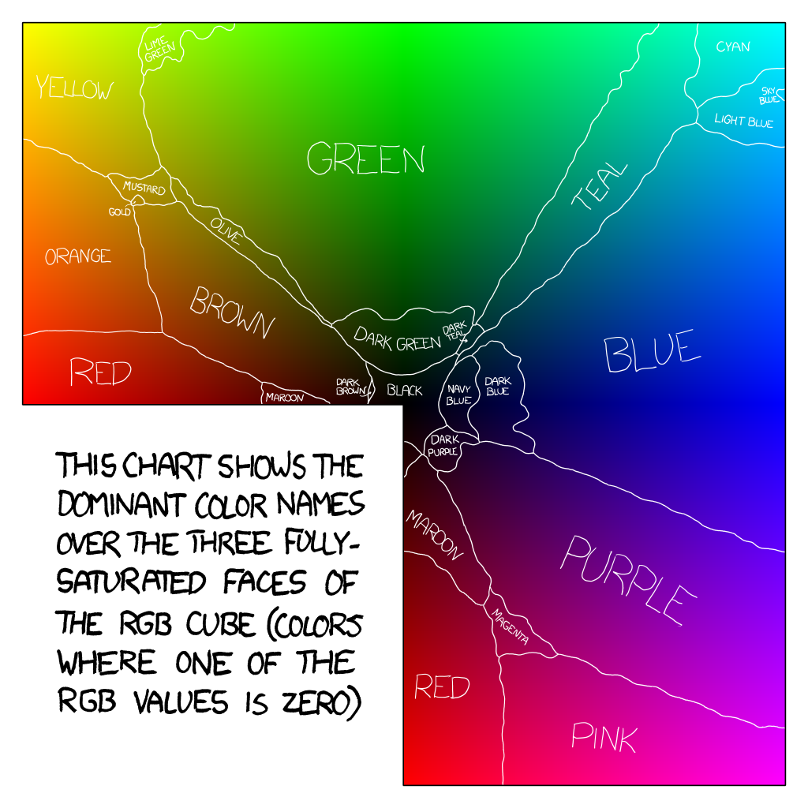

Be particularly careful with blue/green boundaries, as there are significant cultural differences.

Source: https://blog.xkcd.com/2010/05/03/color-survey-results/


---

## Cultural Considerations

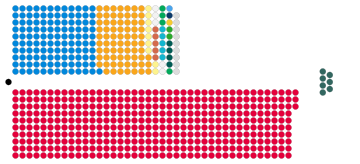

- American audiences associated <span color="red">red</span> & <span color="blue">blue</span> with political parties on any map in a political context.
- Also international meaning of <span color="red">red</span> & <span color="blue">blue</span> is flipped: red is left, blue is right.
- Most other colors have contradictory meanings depending on culture. For example, yellow might be chosen to denote success (parts of Africa) or be associated with death (Middle East).

<!--Source: https://www.color-meanings.com/color-symbolism-different-cultures/-->

<!-- image from wikipedia: UK House of Commons -->

---

## Color Vision Deficiency

More accurate name for what is commonly known as colorblindness.

- Red-Green CVD - most common
    - four types: Dueteranomaly and Protanomaly (mild) to Protanopia and Dueteranopia (complete)
- Tritanomaly/Tritanopia: blue/green and yellow/red confusion.
- rarest, complete lack of color vision, usually corresponds to other vision issues as well

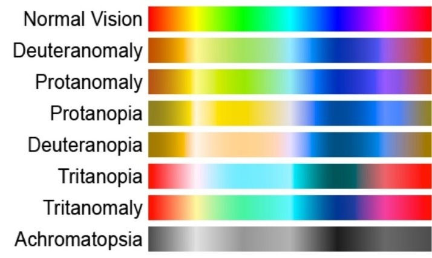

---

## Color on a Page

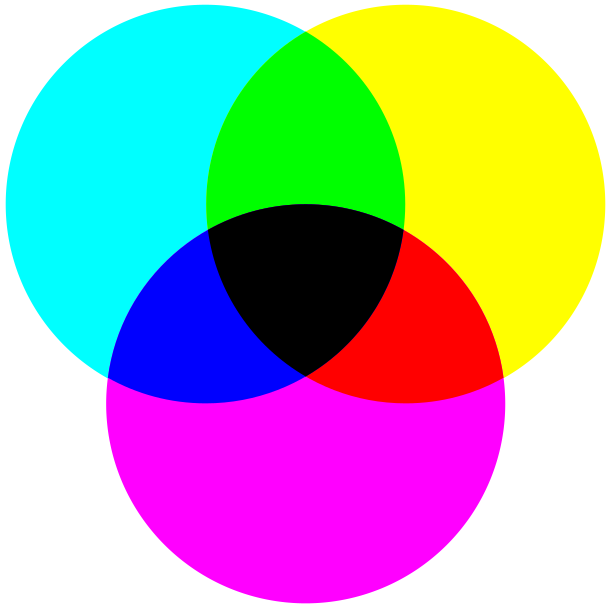

Ink absorbs light, so we work with subtractive blending.  Our base colors are cyan, magenta, and yellow.  To save on ink costs, we throw in black/contrast as well.

We call this CMYK color.

---

## Color on a Screen

Screens emit light, which means we use **additive blending** of red, green, and blue light. Every pixel of a screen can emit these three colors in different intensities.


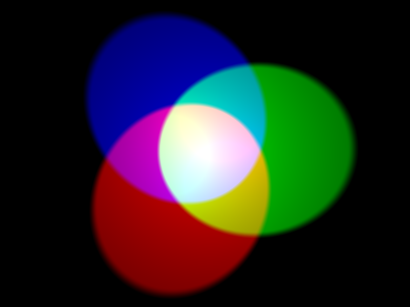

---

## Color Spaces

Ways of describing a color mathematically, usually have 3 components to match our perception of color:

- RGB (early photography)
- CIE XYZ (1931)
- HSB/HSV/HSL (1970s)

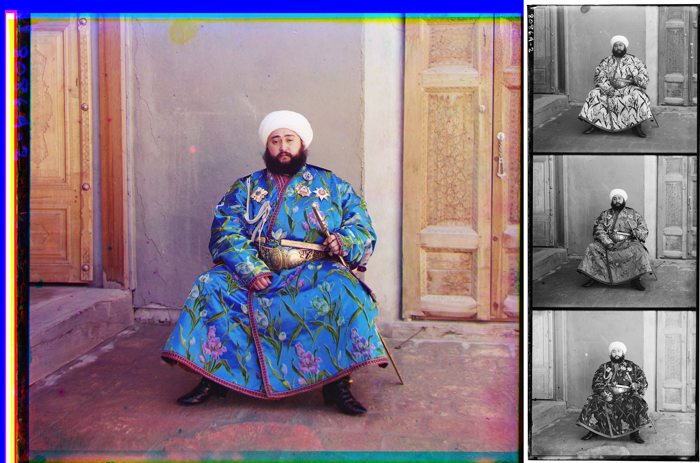

<!-- https://commons.wikimedia.org/wiki/File:Rgb-compose-Alim_Khan.jpg -->

---

A common way to refer to colors is by their intensity in each of these three channels.

<span style="color: rgb(0% 100% 0%)">this is 0% red, 100% green, 0% blue intensity (#00ff00)</span>
<span style="color: rgb(20% 60% 20%)">this is 20% red, 60% green, 20% blue intensity: (#143c14)</span>
<span style="color: #ff00ff">this is 100% red, 0% green, 100% blue intensity: #ff00ff</span>

This is sometimes expressed in hexadecimal:

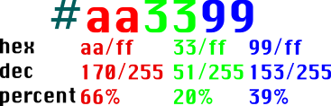


---

### RGB space as a cube

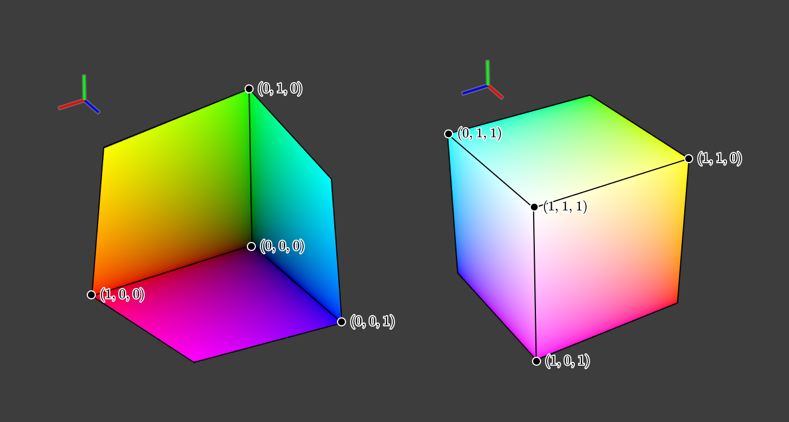

---

### RGB as pair plots

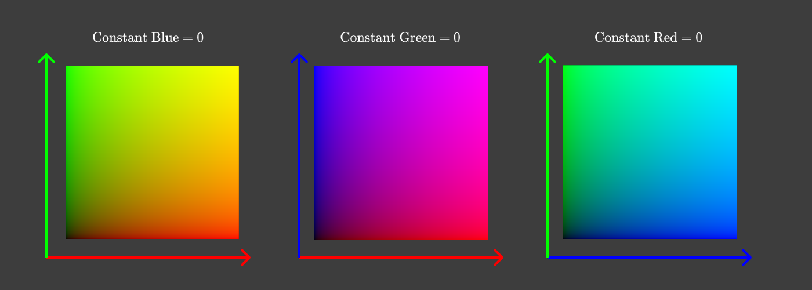

Remember this trick for your own 3-dimensional data!

---

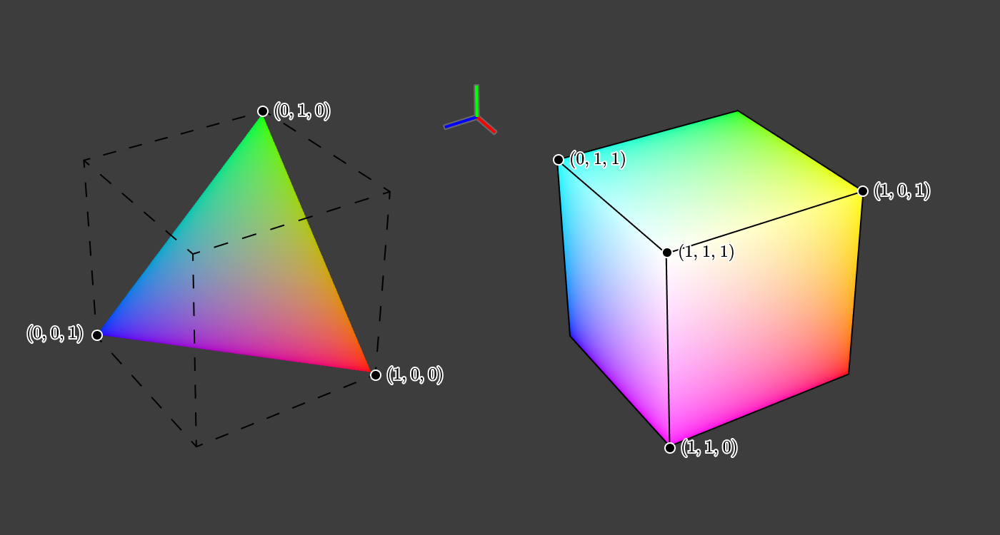

A slice through the middle of the cube gives colors of comparable brightness.  (You may have seen such a triangle in color pickers.)

---

## HSL

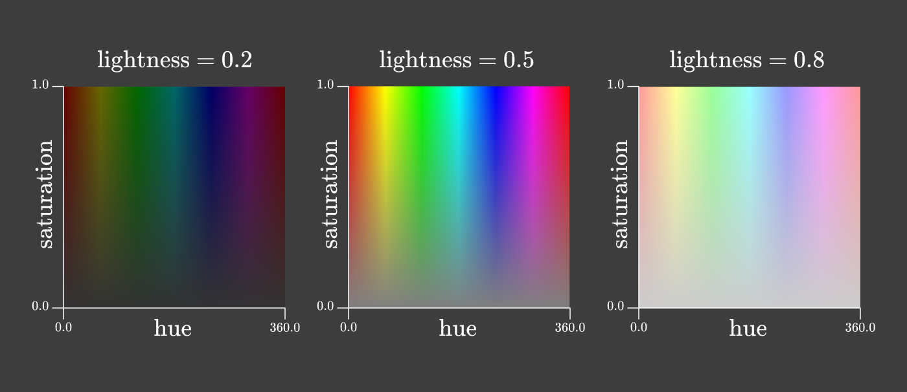

An alternative color space that's very useful for visualization is HSL color space.

Hue, Saturation, Lightness | <https://hslpicker.com/>

---

## Aside: What about "alpha"?

You will often see a fourth channel: RGB**A**, HSL**A**.

This is known as alpha transparency (translucency).

This has to do with how the program in question *blends* the colors. The final pixel values on the screen will still be converted to RGB components.

- Use sparingly.
- Variations are very subtle, and background dependent.

<!-- image source: https://upload.wikimedia.org/wikipedia/commons/3/34/RGB_pixels.jpg -->

---

## CIE (RGB / XYZ / CIELAB)

Based on human perception experiments where people would adjust dials to recreate colors out of red, green, and blue light.

First from 1920s, revised in 1970s.

*Commission internationale de l'éclairage*  (Illumination)

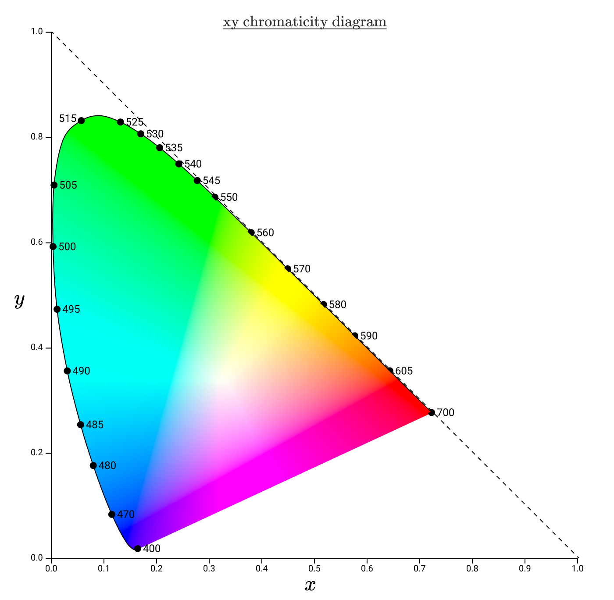

---

## Screen Gamut

Screens can't show the entire range of visible colors accurately, they define a "gamut".  Since ~1996 most devices aim at a standard gamut to ensure similar representations of color, but even high end devices are not perfectly aligned.

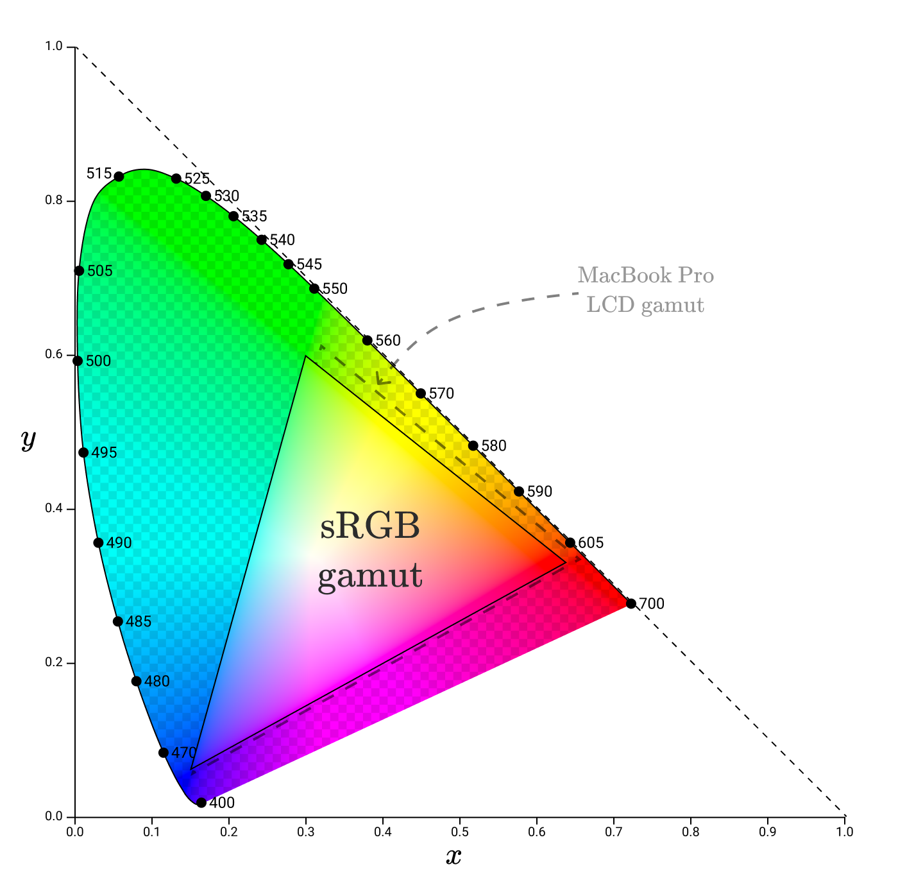

Projectors (like the one you're likely viewing this on) usually have skewed gamut. 

Moral of the story: **Consider your medium!**

---

## What does all this mean for visualization?

Color choices should be made with respect to:

  - medium (screen vs. print, type of screen)
  - audience (culture, vision differences, expectations)
  - differentiability

Using HSL to build a palette allows you to choose uniform brightness/saturation and pick hues as close together/far apart as needed.

---

## Role of Color

- **Identify** - Different color per category/actor.
  - opt for distinct hues
- **Group** - Group like entities using same/like colors.
  - often with similar hues
- **Layer** - Overlay different information while keeping contrast.
  - saturation differences very important to not overwhelm eye
- **Highlight** - Call out important/relevant information.
  - brightness and hue differences important

--- 

## Color Channels & Data Types

### Lightness is perceived as ordered

Good for **Ordinal** variables


**Quantitative** (Continuous) variables harder to discern


### Hue typically unordered

**Nominal** variables.


---

### Types of Palettes

- Qualitative - Nominal data
- Sequential - Quantitative data
- Diverging - Data with a meaningful zero-point (increase/decrease, more/less)

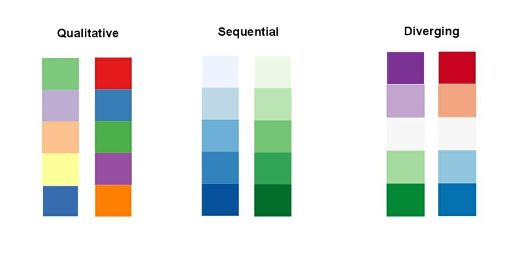

<!-- source: Peter Aldhous, NICAR 2016 -->

---

### Hue Separation

Pick distinct hues for unrelated variables.

Grouped schemes can be used where there are relationships among the categories.

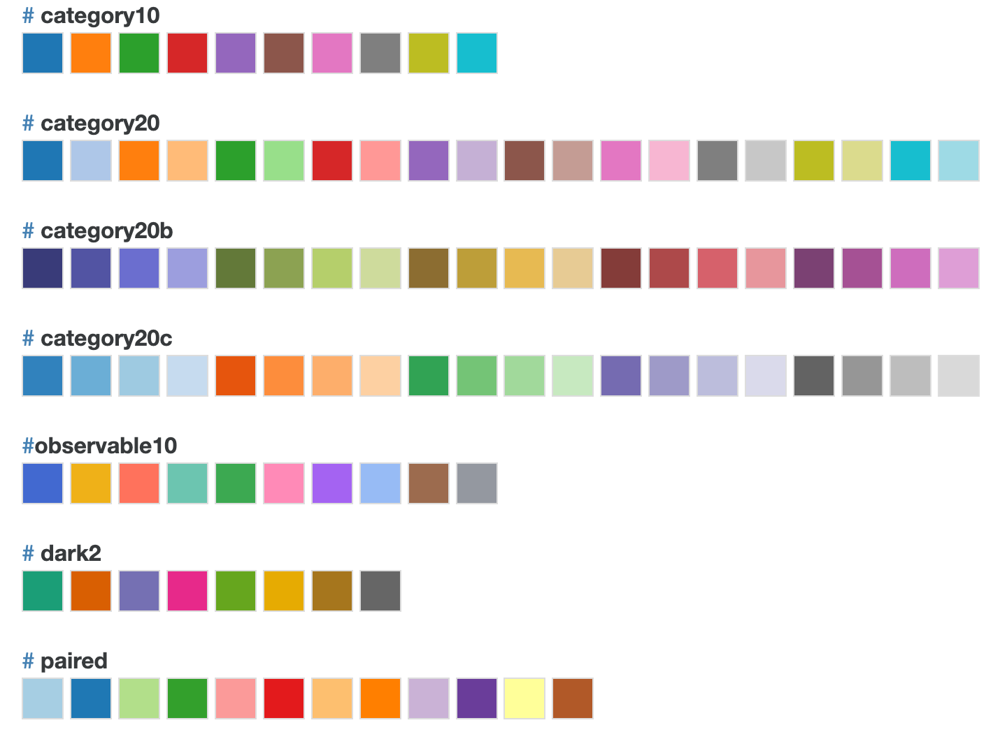

<https://vega.github.io/vega/docs/schemes/>

---

## Color Tips

- Aim for no more than ~6 colors that need to be distinguished.
- Colors should be distinct & differentiable by name.
- Be mindful of cultural considerations & symbolism.
- Ensure color schemes chosen appropriately for types of data.
- "Get it right in black & white"


---

## "Get it right in black & white"

A common mantra among visual designers.

Ensure that your hues have different brightness levels.

Ensure that you aren't using hue alone for your image.

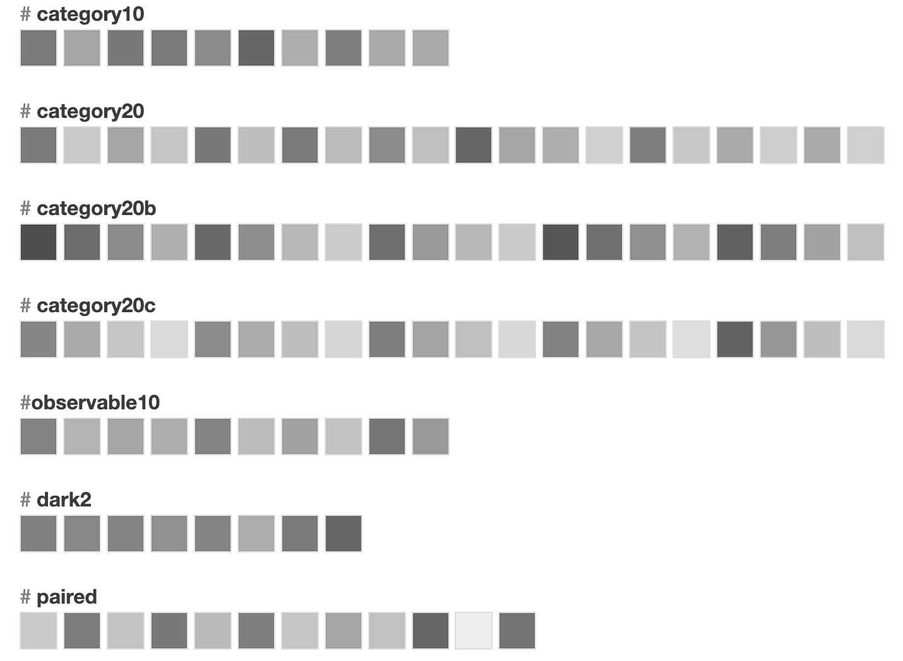

---

## Text Legibility

An important issue when using colored text and/or backgrounds is **legibility**.

Web Content Accessibility Guidelines require a 4.5 color contrast (3:1 for large text).

Minimize *saturation* in backgrounds, pick a font color with opposing *lightness*.

<https://webaim.org/resources/contrastchecker/>

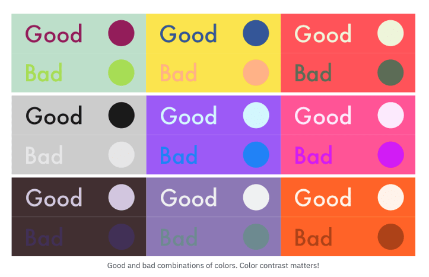


---

## Tools

- Vega Schemes: https://vega.github.io/vega/docs/schemes/
- Contrast/theme exploration: https://schubert-da.github.io/dataviz-palette-tool/
- Theme exploration for cartography: <https://colorbrewer2.org/>
- Color-theory based theme creator: https://meodai.github.io/poline/
- Theme creator w/ theme sharing: https://coolors.co
- HSL/RGB picker: <https://hslpicker.com/>
- Contast checker: <https://webaim.org/resources/contrastchecker/>

### Color-Blindness

- MacOS/iOS app: https://michelf.ca/projects/sim-daltonism/
- Browser extensions (search "colorblindness" in your browser of choice)

---

## Acknowledgements & References

Thanks to Alex Hale, Andrew McNutt, and Jessica Hullman for sharing their materials.

Color space images are from <https://jamie-wong.com/post/color/>, which is an incredible resource if you'd like to go deeper into both the biology and math of color.

- https://www.math.csi.cuny.edu/~mvj/GC-DataViz-S23/lectures/L6.html
- https://en.wikipedia.org/wiki/Stevens%27s_power_law
- https://colorusage.arc.nasa.gov
- https://vega.github.io/vega/docs/schemes/
