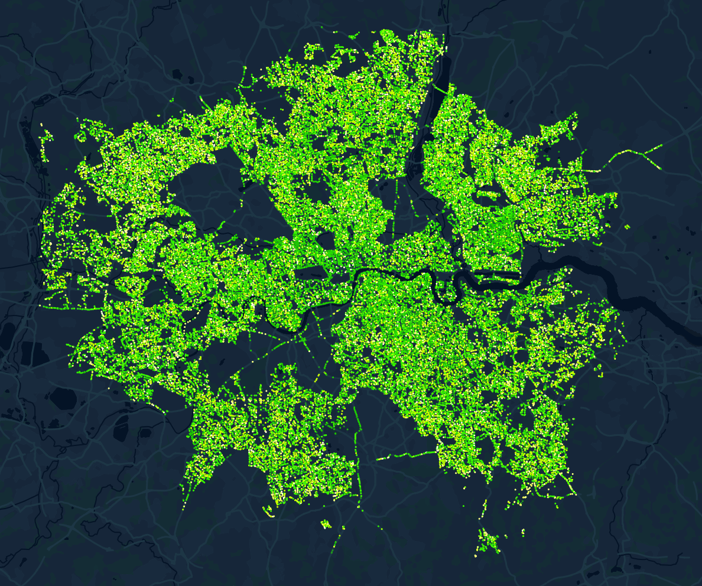

# Chart Design

## CAPP 30239

---

## Today

- What general **principles of visual design** are relevant to our work?
- What are the **common types of charts** and how do we use them?
- When and how do we break the rules?

---

## Edward Tufte

### The Visual Display of Quantitative Information

---

## Key Ideas

- Graphical Integrity: Above all else, show the data.
- Maximize the data-ink ratio.
- Minimize chart junk.
- Aim for high chart density, consider *small multiples*.
- Revision & Editing are essential.

---

## Tufte's Principles for **Graphical Integrity**
---

1. The representation of numbers, as physically measured on the surface of the graphic itself, should be directly **proportional** to the numerical quantities represented.

Mileage increase: 53%
Graph length increase: 783%
"Lie Factor": 14.8x

---

2. Clear, detailed and thorough **labeling** should be used to defeat graphical distortion and ambiguity.

How many children get a spinal injury every year? (out of 74,000,000 children in US)

Note: there are only 22,000 total spinal cord injuries a year in America (and most are 16-30yo).

<!-- .0000003% -->

---

3. Write out explanation of the data on the graphic itself. **Label important events** in the data.

---

4. Show **data variation, not design variation**.

Deflated & standardized units of money are almost almost superior to nominal units.

The number of information-carrying (variable) dimensions depicted should not exceed the number of dimensions in the data. (roughly 1:1 channel mapping)

Exception: It is OK/common to pair color & shape, or for print color & texture to address issues that color presents.

---

## Axes/Scale Mistakes

- Carefully consider not starting at zero.
- Beware dual axes.
- Consider audience when using log scale.
- Related: No pie charts that don't add up to 100%

---

---

---

---

---

## Data-Ink Ratio

- **Data-ink**: Ink (pixels) used to show data.
- Data-ink ratio: data-ink / total-ink

---

---

## Optimizing Data Density

Number of entries in DataFrame / Area of Graphic.

Classic example of high data density is the sparkline, which can fit on a line of text.

---

## Chart Junk

Anything that isn't relevant to understanding the data.

---

via junkcharts.typepad.com

---

## Common Chart Types

---

## How to Pick?

- Quantitative / Quantitative: 
- Quantitative / Temporal: 
- Quantitative / Nominal: 
- Nominal / Nominal: 

---

### Bar Charts & Histograms

- X/Y: Nominal (Binned Numerical - Histogram)
- Y/X: Quantitative
- Area must be relevant on bar charts: no log scales/cut axes!

---

### Line & Area Charts

- X: Temporal / Quantitative
- Y: Quantitative (means / sums)

---

### When to use stacked area charts?

Sum of stacked axis variable **must have meaning**.

---

### Heatmap

- X & Y: Quantitative or Nominal
- Color: Quantitative
- `mark_rect`

---

### Strip Plot

- Y: Nominal
- X: Temporal or Quantitative
- Color: Optional (any type)
- `mark_tick`

---

### Pie / Donut / Radial Charts

Theta: Quantitative (ratio)
Color: Nominal

Direct comparison of segments is very difficult at n > 2.

Only use when most important information is ratio between sizes, and relatively few categories.

**Must add up to 100%**

---

https://www.storytellingwithdata.com/blog/2020/5/14/what-is-a-pie-chart

---

### Bump / Rank Line Chart

Useful for showing changes in relative positioning.

Require some data manipulation using `transform_window` or pre-computing ranks. (see Altair gallery examples.)

---

### Scatter & Bubble Plots

- X / Y: Quantitative

Bubble charts use size as a 3rd dimension.

(Note subtle but useful transparency usage as well.)

---

### Small Multiples / Faceting

<!-- source: https://www.juiceanalytics.com/writing/better-know-visualization-small-multiples -->

Useful when there is a nominal variable being compared across two other dimensions.

---

<!-- source https://obamawhitehouse.archives.gov/interactive-budget -->

---

### Map Basics

Two most common:

- point maps
- choropleths

*Image: Trees in London, data.london.gov.uk*

<!-- source: https://data.london.gov.uk/dataset/local-authority-maintained-trees#:~:text=The%20data%20does%20not%20represent,streets%2C%20private%20gardens%20and%20more. -->

**We will revisit maps later in this course.**

--- 

## Two choropleths, same data.

<!-- source: https://carto.maps.arcgis.com/apps/webappviewer/index.html?id=7475c5788efe4c75a9642f552f61d568 -->

Color scale & unit of measurement is incredibly important.

Consider alternatives if district/population sizes vary significantly.

---

## When & How to Break the Rules

**When in doubt...**

9 out of 10 visualizations should be some variation of the common types.

This does not need to hamper creativity, in the right context a little flourish can add a lot. But ensure that it does not obfuscate the data.

Focus on Tufte's principles & ask for feedback!

---

### Case Study: Two Innovations

Two visualization types that have had their moment in the past 10-15 years:

- Hex/Grid Maps
- Word Clouds

---

## Grid Map

Introduced in <https://blog.apps.npr.org/2015/05/11/hex-tile-maps.html>

<!-- discuss: is this a good thing? -->

---

## Word Cloud

---

Derived from same data as word cloud.

source: NYTimes via https://www.niemanlab.org/2011/10/word-clouds-considered-harmful/

---

## Narrative-supporting graphics

by ulaniulani on flickr

---

### When it's OK to use 3D

You have data that relates to a spatial third dimension.

(Image: Snowfall, NY Times)
(Image: CERN Large Hadron Collider)

---

## Acknowledgements & References

Thanks to Alex Hale, Andrew McNutt, and Jessica Hullman for sharing their materials.

- https://www2.cs.uh.edu/~ceick/NO/COSC3337-DV2.pdf 
- Images from Tufte's Visual Display of Quantitative Information
- Images from Altair <https://altair-viz.github.io/gallery/index.html>

