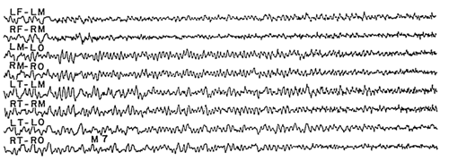
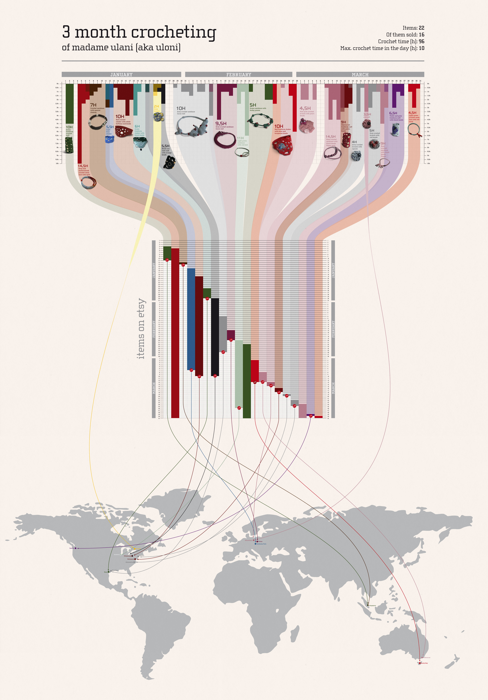

# Chart Design

## CAPP 30239

---

## Today

- What general **principles of visual design** are relevant to our work?
- What are the **common types of charts** and how do we use them?
- When and how do we break the rules?

---

## Edward Tufte

### The Visual Display of Quantitative Information

---

## Key Ideas

- Graphical Integrity: Above all else, show the data.
- Maximize the data-ink ratio.
- Minimize chart junk.
- Aim for high chart density, consider *small multiples*.
- Revision & Editing are essential.

---

## Tufte's Principles for **Graphical Integrity**
---

1. The representation of numbers, as physically measured on the surface of the graphic itself, should be directly **proportional** to the numerical quantities represented.

Mileage increase: 53%
Graph length increase: 783%
"Lie Factor": 14.8x

---

2. Clear, detailed and thorough **labeling** should be used to defeat graphical distortion and ambiguity.

How many children get a spinal injury every year? (out of 74,000,000 children in US)

<!-- .0000003% -->

---

3. Write out explanation of the data on the graphic itself. **Label important events** in the data.

---

4. Show **data variation, not design variation**.

Deflated & standardized units of money are almost almost superior to nominal units.

The number of information-carrying (variable) dimensions depicted should not exceed the number of dimensions in the data. (roughly 1:1 channel mapping)

Exception: It is OK/common to pair color & shape, or for print color & texture to address issues that color presents.

---

## Data-Ink Ratio

- **Data-ink**: Ink (pixels) used to show data.
- Data-ink ratio: data-ink / total-ink

---

---

## Optimizing Data Density

Number of entries in DataFrame / Area of Graphic.

Classic example of high data density is the sparkline, which can fit on a line of text.

---

## Chart Junk

Anything that isn't relevant to understanding the data.

---

via junkcharts.typepad.com

---

## Common Chart Types

---

### Bar Charts & Histograms

- X/Y: Nominal (Binned Numerical - Histogram)
- Y/X: Quantitative

---

### Line & Area Charts

- X: Temporal
- Y: Quantitative

---

### When to use stacked area charts?

Combined X axis variable has meaning.

---

### Heatmap

- X & Y: Quantitative or Nominal
- Color: Quantitative
- `mark_rect`

---

### Strip Plot

- Y: Nominal
- X: Temporal or Quantitative
- Color: Optional (any type)
- `mark_tick`

---

### Pie / Donut / Radial Charts

Theta: Quantitative (ratio)
Color: Nominal

Direct comparison of segments is very difficult at n > 2.

Only use when most important information is ratio between sizes, and relatively few categories.

---

https://www.storytellingwithdata.com/blog/2020/5/14/what-is-a-pie-chart

---

### Bump / Rank Line Chart

Useful for showing changes in relative positioning.

Require some data manipulation using `transform_window` or pre-computing ranks. (see Altair gallery examples.)

---

### Scatter & Bubble Plots

- X / Y: Quantitative

Bubble charts use size as a 3rd dimension.

---

### Small Multiples / Faceting

<!-- source: https://www.juiceanalytics.com/writing/better-know-visualization-small-multiples -->

Most useful when there is a nominal variable that charts vary on.

---

### Distributions

### Map Basics

---

## When & How to Break the Rules

**When in doubt...**

- 95% of visualizations should be some variation of the common types.
- Focus on Tufte's rules for clarity.

---

### Case Study: Two Innovations

Two visualization types that have had their moment in the past 10-15 years:

- Hex/Grid Maps
- Word Clouds

---

## Grid Map

Introduced in <https://blog.apps.npr.org/2015/05/11/hex-tile-maps.html>

<!-- discuss: is this a good thing? -->

---

## Word Cloud

---

Derived from same data as word cloud.

source: NYTimes via https://www.niemanlab.org/2011/10/word-clouds-considered-harmful/

---

## Narrative-supporting graphics

by ulaniulani on flickr

---

### When it's OK to use 3D

You have data that truly makes more sense in 3D.

and/or

You work at CERN.

---

## Acknowledgements & References

Thanks to Alex Hale, Andrew McNutt, and Jessica Hullman for sharing their materials.

- https://www2.cs.uh.edu/~ceick/NO/COSC3337-DV2.pdf 
- Images from Tufte's Visual Display of Quantitative Information
- Images from Altair <https://altair-viz.github.io/gallery/index.html>

