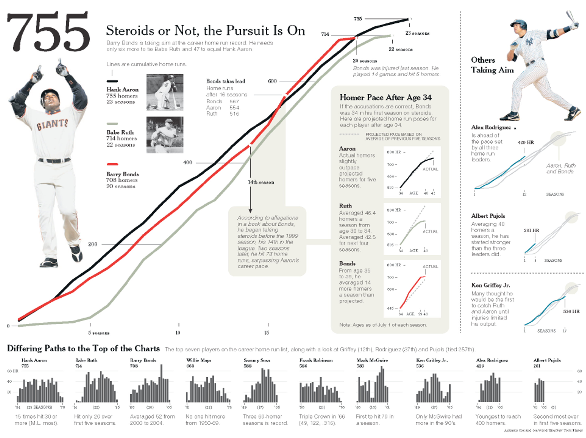
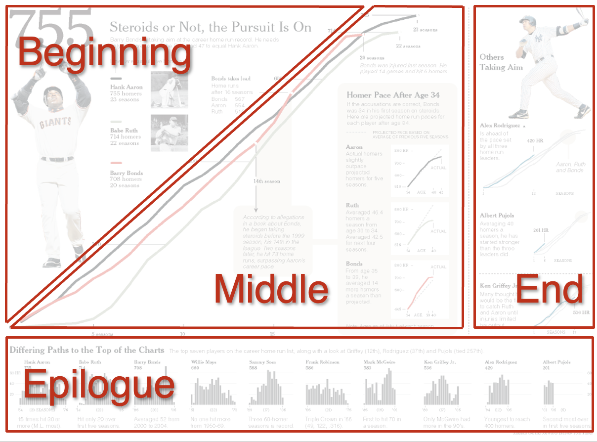
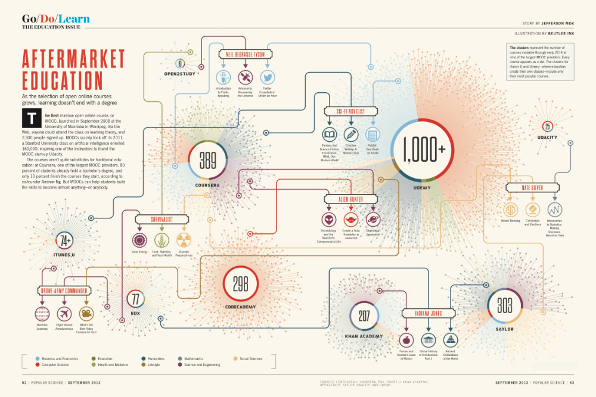
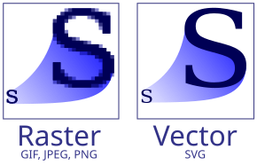

# Narratives

## CAPP 30239

---

## Today

- What types of data visualization narratives exist?
- Practical advice on creating publications & pages.
- Narrative Examples

---

## Crafting a Narrative

**Narrative** = **Visualization** + **Context**

### Benefits

- More engaged audience.
    - Greussing & Boomgaarden, Digital Journalism 2019.
- Better learning outcomes.
    - Mayer, Multimedia Principles, 2005.
- Promote active reading.
    - Victor, Explorable Explanations, 2011.
- Persuasiveness of data.
    - Murray, Data Visualization And The Power Of Persuasion, 2019.

---

## Storytelling

Instead of a loosely connected series of images, take reader on a journey with a beginning, middle, and end.

- Beginning: Required Context, Pose Questions
- Middle: Exposition & Exploration
- End: Conclusion and/or Further Questions

---

## Risks

**Oversimplification.** Constraints of format can lead to the need to simplify, finding the right balance requires skill, practice, and knowledge of audience.

**Bias.** All narratives require interpretation, which can be a source of bias. We should not compromise on **graphical integrity** to make our point, or suggest conclusions that are not supported by the data.

---

## Medium is the Message

"[...]medium is the message. This is merely to say that the
personal and social consequences of any medium— that is, of any extension of ourselves— result from the new scale that is introduced into our affairs by each extension of ourselves, or by any new technology."

*Marshall McLuhan, Understanding Media: The Extensions of Man, 1964.*

The nature of a narrative is shaped by (dominated by) the medium chosen.

- Standard "Print" Article
- Infographic
- Live Presentation
- Video / Animation
- Museum / In Person Interaction
- Web Interactives

---

## News Article Format

**Lede/Lead** - Opening paragraph. Summarize key ideas & grab attention.
**"Nut Graf"** - Nutshell paragraph. Immediately follows lead. Gives overview of why topic is important, and introduce key ideas to be explored in article.

"**Inverted Pyramid**"

Example: [Chicago Missing Persons](https://chicagomissingpersons.com/who-goes-missing/) Pulitzer-winning long form piece that CAPP Alum Aïcha Camara contributed to.

---

## "Print" Article

Even if initially viewed on a screen, use static design so can be copied/printed/shared easily.

No vital information in tooltips, animation, etc.

- Text-forward, with supporting visuals. *-or-*
- Visual-centric, with explanatory text.

---

## Infographic

Can be built around a single chart, or combine many into a story.
Typically a single-page image with an arrangement of graphics, tables, and brief narrative.

Typically aimed at general audiences, easy to share online, can be designed to work well in print.

Important to think about visual flow, keep information organized.

Examples:
- <https://www.wri.org/data/infographic-global-carbon-budget>
- <https://www.chartography.net/p/seeing-centuries-part-2>
---

---

---

---

## Live Presentation

Few words, large fonts.

Legibility from distance.

Nature of audience/projector/room.

**Print handouts if visualizations have lots of detail.**

---

## Animations & Videos

Animation can be used to show change, uncertainty, or relationships.

Video can blend presentation with commentary and narrative.

### Examples

- [The best stats you've ever seen - Hans Rosling](https://www.ted.com/talks/hans_rosling_the_best_stats_you_ve_ever_seen?subtitle=en)
- [Planetary Visualization](https://vimeo.com/555245282) (thanks Sam!)
- [NYT Thanksgiving Flight Animations](https://www.nytimes.com/interactive/2015/11/24/upshot/thanksgiving-flight-patterns.html) (thanks Krisha!)

---

## Museum Interactives

[Blue Paradox @ MSI](https://www.blueparadox.com/en/the-exhibit) - Thanks Magdalena!

---

## Interactive Stories

Can take advantage of web as a medium. Seamlessly blend text, images, audio and video, and interactive elements.

### Potential Benefits

- Reducing Cognitive Load
- Personalization for Reader
- Making Information Playful
- Prompting Self-Reflection

**Caveat:** Can overwhelm with options, lose sight of what's important.

---

### Reducing Cognitive Load

Make data pleasant, avoid rigidity of visualization designed for print.

Animations, tooltips, drop-downs, sliders, zoom & pan, highlights.
Used artfully, these can provide ways for complex data to be presented in a more digestible way.

In practical terms, Altair will allow a lot of this, handling the JS for you via Vega-Lite.

Examples:
- <https://flowingdata.com/2015/12/15/a-day-in-the-life-of-americans/>  (thanks David!)
- <https://ourworldindata.org/grapher/covid-people-vaccinated-marimekko?time=2023-04-16>
- <https://www.nytimes.com/interactive/2018/03/27/upshot/make-your-own-mobility-animation.html>
- <https://especiales.eldiario.es/spain-lives-in-flats/> (thanks Michael!)

---

### Personalization For Reader

Engage reader better by showing them the data most relevant to them first.

Excellent way to drill down in large data sets to make it meaningful to reader.

Examples:
- <https://www.nature.org/en-us/get-involved/how-to-help/carbon-footprint-calculator/carbon-by-birth-year/>
- <https://www.nytimes.com/interactive/2018/08/30/climate/how-much-hotter-is-your-hometown.html>

---

### Making Information Playful

Give people tools to explore or run simulations on their own in the browser.
Encourages exploration & engagement.

Examples:
- <https://publicdomain.nypl.org/pd-visualization/>
- <https://www.nytimes.com/interactive/2024/upshot/buy-rent-calculator.html>
- <https://www.economist.com/big-mac-index> (thanks Paul!)
- <https://pudding.cool/2017/05/song-repetition/> (thanks Daniel!)
- <https://bost.ocks.org/mike/algorithms/>

---

### Prompting Self-Reflection

Encourage people to reflect upon expectations & experiences relevant to framing of story.

NYT "You Draw It" Series:
- <https://www.nytimes.com/interactive/2017/04/14/upshot/drug-overdose-epidemic-you-draw-it.html>
- <https://www.nytimes.com/interactive/2015/05/28/upshot/you-draw-it-how-family-income-affects-childrens-college-chances.html>

---

### More Examples...

[NYT Snow Fall](https://www.nytimes.com/projects/2012/snow-fall/index.html#/?part=tunnel-creek)
[Google Public Data Explorer](https://www.google.com/publicdata/explore)
- [pudding.cool](https://pudding.cool) - a data visualization magazine, with lots more inspiration

<!-- these don't neatly fit into the above categories,

does Google Data explorer overwhelm the user? circa 2010 lots of attempts
to create "one viz to rule them all"
-->

---

## What Skills Do You Need?

- Writing
- Design
- Programming (particularly for interactives)
- Subject-matter expertise

---

## SVG vs PNG vs JPG

- **SVG** - Scalable Vector Graphics format.
- **PNG** - Lossless raster image format. Should be preferred if SVG is not an option.
- **JPG** - Image format that uses compression, suitable for photographs but not fine details in visualizations.

---

## Document Formats

- **PDF** - Portable Document Format - A vector-based format aimed at entire documents. PDF documents are aligned to paper sizes, great for printing, but less flexible on modern devices.
- **HTML** - HyperText Markup Language - The language of the web, focused on *semantics* over layout. A document can appear differently on different devices.
- **CSS** - Cascading Style Sheets - A *styling* language that, when applied to an HTML document controls visual appearance.
- **Markdown** - Simplified markup language that can be converted to HTML or PDF with various tools. Offers **much** less control over formatting than other options.

---

## In Practice

1. Most professional data visualization starts with data-driven tools (code-driven like Altair or no-code like Tableau), which are then exported as SVG.

2. Those SVGs will then be embedded in a larger graphic or HTML page.

3. Export/render to final form(s):
  - For web presentation: HTML/CSS will be the final form. If interactivity is at play, JavaScript will be a part of the process.
  - For print or PDF: The intermediate format used by a print design tool will be exported to a PDF of the appropriate size & resolution.

---

## Tools: Typesetting Languages

- **LaTeX** - PDF-focused, almost anything via plugins/pandoc.
    - [Overleaf](https://overleaf.com) - online editor and compiler.
    - [Tectonic](https://tectonic-typesetting.github.io/en-US/) - local LateX compiler.
- **[Typst](https://typst.app)** - PDF-focused, (HTML coming soon).
- **[Quarto](https://quarto.org)** - Can use mix of Markdown, Python, R, and Julia.  Jupyter notebook compatible.  Can generate PDFs or HTML from same source document.

<!--
**LaTeX** is the most widely used in academic & scientific circles. It is a document typesetting language designed originally for Computer Science text.  The author, Donald Knuth, created the original (TeX) so he could typeset his magnum opus, *The Art of Computer Programming*.  The easiest way to work with LaTeX is to use , an online editor & compiler. Many versions exist that can be run locally, such as 
-->

---

## Tools: Vector Graphics Editors

- **[Inkscape](https://inkscape.org)** - Free & Open Source SVG editor. My recommendation for this class if you don't have prior experience with other options.
- **Adobe Illustrator** - Vector graphics editor, part of Adobe Creative Suite. Dominant option for many years. (Most expensive.)
- **Affinity Designer** - Competitor to Illustrator, much cheaper, full-featured, and gaining popularity because of Adobe's subscription model & business practices.

### Honorable Mentions

- **[Graphite](https://graphite.rs/learn/)** - Mix of GUI/programmatic SVG editing.
- **BoxySVG** - Online/browser-based SVG editor.
- **Canva** - Popular for infographics, collection of free clip art/etc. 

---

## References & Acknowledgements

- Thanks to Alex Kale.
- American Journalism Handbook: Leads & Nut Grafs: <https://ajh.rodrigozamith.com/creating-journalistic-content/leads-and-nut-grafs/>
- <https://www.forbes.com/sites/evamurray/2019/02/11/data-visualization-and-the-power-of-persuasion/>
