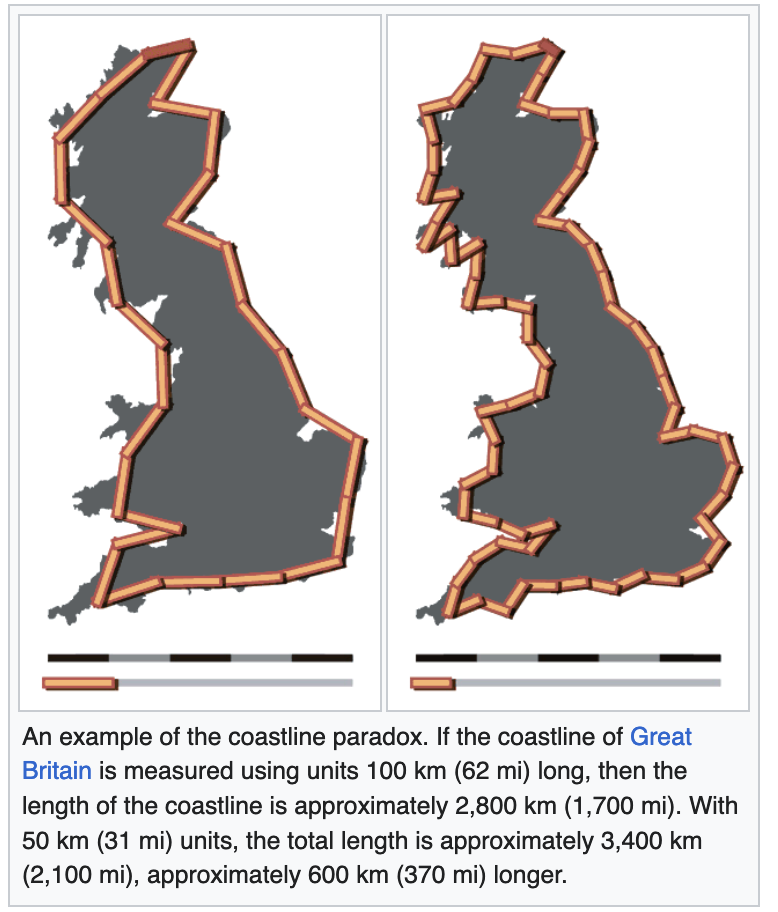
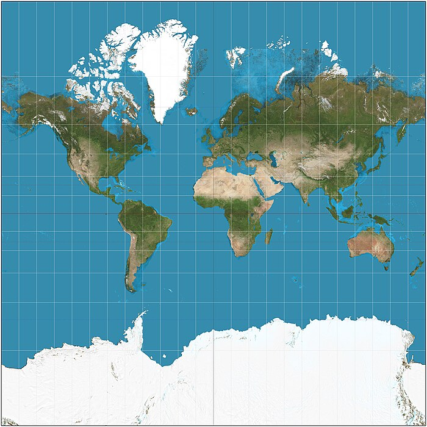
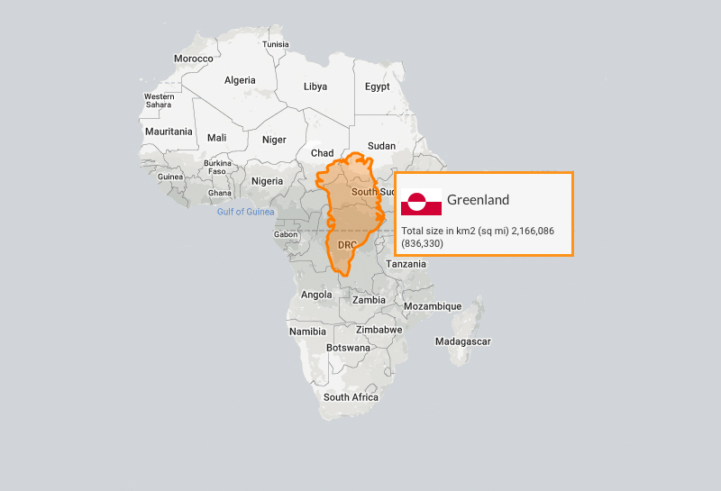
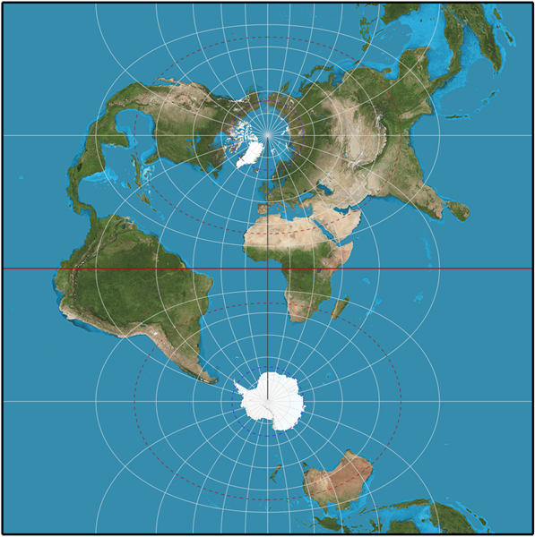
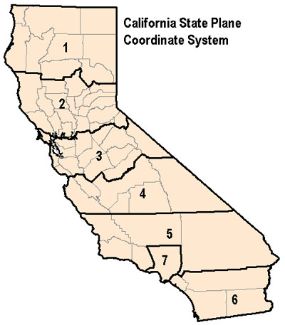

# GIS Fundamentals
## CAPP 30239

---

## Today

Establish a baseline understanding of GIS data.

(Not focused on Data Viz)

---

## GIS Fundamentals

**GIS** - Geographic Information System - Specialized set of tools for dealing with geospatial data.

### What's special about GIS?

(source: NASA.gov)

---

## Quantity of data: coastline paradox

(source: Coastline Paradox on Wikipedia)

---

## GIS Data Caveats

### Resolution

We have to decide what resolution is important.  Even at a fairly low fidelity, a shape is likely to have tens of thousands of points.

### Projection

The earth is not flat, but we typically work in (x, y, [altitude]).  This requires **projection**.

---

**What's wrong with this picture?**

Mercator Projection, Wikipedia

---

## Africa is 14x larger

<https://mortenjonassen.dk/maps/greenland-vs-africa-size-comparison>

---

## Spatial Data Types

|          | Raster                                                     | Vector                                                                  |
|----------------|------------------------------------------------------------|-----------------------------------------------------------------|
| **Image Format**   | JPEG/PNG | SVG/PDF                                 |
| **GIS File Types**     | GeoTIFF/NetCDF    | Shapefile/GeoJSON/Geopackage/KML             |
| **Example Data**   | Satellite imagery | - Points: cities - Lines: roads - Polygons: land parcels |
| **Typical Tool**  | Camera | GPS |

---

|          | Raster                                                     | Vector                                                                  |
|----------------|------------------------------------------------------------|-----------------------------------------------------------------|
| **Pros**           | Efficient for continuous surfaces (can sample any point) | Arbitrary precision; Ease of calculation; Network efficiency |
| **Cons**           | Limited by image resolution (sensor & storage) | Harder to create as specific relationships must be calculated and defined |

<!--
This is not unique to GIS, image files can be raster or vector as well, with nearly the same meaning.

A raster is a grid or matrix, such as the pixels that make up an image. In GIS terms this is often a satellite image, but any representation of the space where each cell in a grid has properties with a given meaning is a raster.

A raster can be though of as a series of values `(x, y, val)` where `val` is a color or similar. The `x` and `y` coordinates could be specified in any unit, allowing one "pixel" to represent 1 sq km or 1 sq mm depending on the needs of the program.

Vector data is instead a series of geometric primitives.  They are defined in relationship to one another, allowing groups and other relationships to be estabished. We'll address the specifics more after we compare Vector data to Raster data.

-->

---

## GIS Vector Data Types

- **Point** - `(lat, lon)` or `(lat, lon, altitude)` - example: address, tree, bus stop
- **Line** aka **Polyline** - series of ordered, connected points - examples: roads, rivers
- **Polygon** - enclosed areas - lakes, land parcels, county

Container Types:

- **MultiPoint** - example: fleet location, fire hydrants, GPS pings
- **MultiLineString** - example: branching transit line
- **MultiPolygon** - example: islands

This allows us to think about a group of related polygons as one:
e.g. does this storm path (Polyline) intersect with Hawaii (MultiPolygon)?

---

### Coordinate Reference Systems

These systems define what the `x` and `y` values actually mean in a given file.

Two kinds:
- **Geographic Coordinate Systems** - attempt to map a lat, lon to every point on Earth
- **Projected Coordinate Systems** - attempt to project earth's curved surface onto a plane (as needed for drawing)

---

Two kinds, infinite variations.

**Why are there multiple of each?**

GCS - regional or local variations in earth's curvature, and different estimates as to exact size of earth.
PCS - no perfect mapping of sphere to x,y plane exists, as seen with Mercator projection, accuracy in one area of globe means distortion in others

**WGS84** is used in GPS and therefore is by far the most common GCS.

---

PCS is not so uniform, but most common is the **UTM** is the Transverse Mercator projection, which minimizes distortion within a region via a set of guarantees.

---

Localities will often publish in a more local projections:

SPCS - State Plane Coordinate System, actually 125 zones with their own system across US.  They are fine-tuned to fit the shape of each state to maximize accuracy. (Some use transverse Mercator, some use a Lambert conformal conic projection, all with different parameters.

(ce: conservation.ca.gov)

---

## rm *.prj

In practice, it is **essential** that you know what CRS your data is in and what CRS you are displaying it in. 
Failure to do so leads to incorrect results, heavily distorted maps, and real-world trouble.

---

### Features

Another property of most GIS filetypes is that they have **features**.  You can think of features as a database or spreadsheet of attributes associated with a given shape.  It might take the form:

| County Name | Population (2020) | Area (sq mi) | County Seat | Georeference |
|-------------|-------------------|--------------|-------------|--------------|
| Cook        | 5,275,541         | 1,635        | Chicago     | {...}        |
| DuPage      | 932,877           | 334          | Wheaton     | {...}        |
| Lake        | 714,342           | 448          | Waukegan    | {...}        |
| Will        | 690,743           | 837          | Joliet      | {...}        |
| Kane        | 516,522           | 524          | Geneva      | {...}        |

Georeference column is either the geometry definition itself, or a foreign key (primary ID) for the given datum.

---

### Formats

- **shapefile** - actually a bunch of files that need to live in the same directory
    - .shp - geometries
    - .shx - indexes for searching
    - .dbf - csv-like features
    - .prj - projection (CRS)
    - .sbn/.sbx/.shp.xml/.cpg - additional optional files that provide more metadata and features

- **GeoJSON/TopoJSON**: JSON representation of features and geometries
- **KML**: Google XML-based format, mostly out of favor but still commonly found on GIS sites
- **Geopackage**: Still uncommon, sqlite based successor to shapefile.

---

### Spatial Queries

These form the common spatial queries, which mostly take the form:

`operation(geometry1, geometry2, optional_tolerance) -> geometry_result`

Example operations: `nearest`, `contains`, `adjacent_to`

Let's convert all of these to GIS terms:

* Where is the nearest Waffle House?
  * nearest(my_location, waffle_house_multipoint)
* What congressional district am I in?
  * contains(congressional_district_multipoly, my_location)
* What cool attractions are close to my drive?
  * nearest(my_route, roadside_attractions_multipoint, tolerance=10miles)

---

## Spatial Overlays

* Union: combine two or more geometries into one
* Intersection: identify overlap (IL & fresh water)
* Difference: Cook County - Chicago

* What part of the US is either national park *or* state park?
  * `union(national_parks_mp, state_parks_mp)`
* How much of Illinois is fresh water?
  * `intersection(il_boundaries, fresh_water_mp)`
* What parts of Cook County are *not* within Chicago?
  * `difference(cook_co, chicago)`

---

### Buffering & Joins

Some other common functionality:

**Buffering** is taking an existing shape and pushing the edge out by some distance. This turns a point into a circle, or a line into a polygon, or expands polygons.

An example buffering operation:

`current_location.buffer(1000).contains(waffle_houses)`

Turn a point into a circle with radius 1km, and see if that circle contains any waffle houses.

**Geospatial Joins** combine two or more datasets on a condition (like overlaps or contains).  This technique is used to discover overlaps between datasets, for example, to find what counties are in which cities:

`joined_data = [(county, city) for county in counties for city in cities if county.geometry.intersects(city.geometry)]`

---

## Geospatial Software

(skip in lecture)

**OGC Simple Features** - Defines common interface (types and operations) for GIS.

Most geospatial software implements some version of this.

The most common of these is **GEOS** a C++ implementation of the specification that provides the common types and operations. ( Geometry Engine, Open Source )

A related library is **GDAL** which handles loading file formats:

https://gdal.org/index.html for list of formats

### PostGIS

GIS primitives as first-class types in database.  Allows querying directly from database, saving conversion and minimizing memory footprint.  (Like most things Postgres, one of the most solid pieces of software ever built.)

---

### GeoPandas

Wraps Shapely and provides a pandas like interface.  

*NOT EFFICIENT* fine for simple use, but quickly baloons to unusably large memory footprints without polygon simplification. (Reducing detail by eliding points.)

### ArcGIS

Commercial/proprietary service. Developed by ESRI, the key commercial player in GIS for decades.

Offers cloud/server/desktop based tools.

Favored in government, large corporations, full suite is most feature complete offering around. Under increasing competition from OSS competitors which are often more lean, cutting lesser-used features and antiquated formats.

---

## Next

Mapping Frameworks
