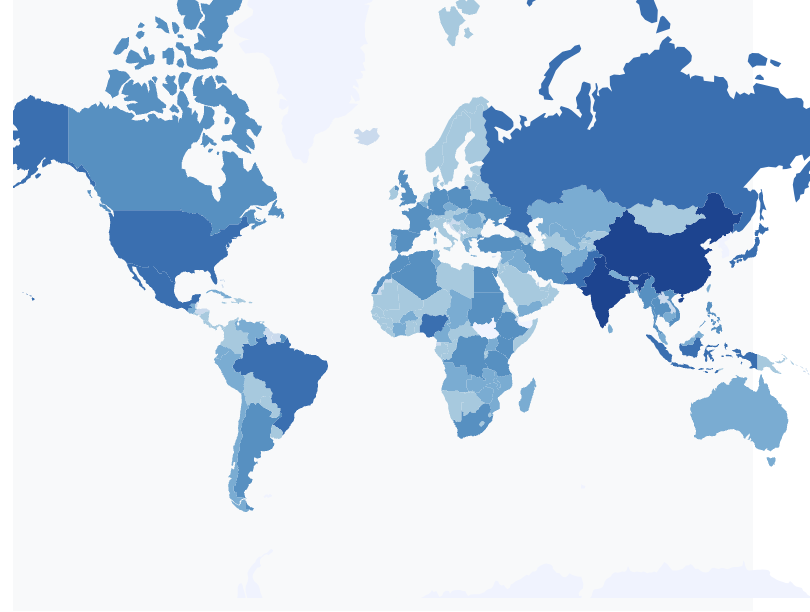
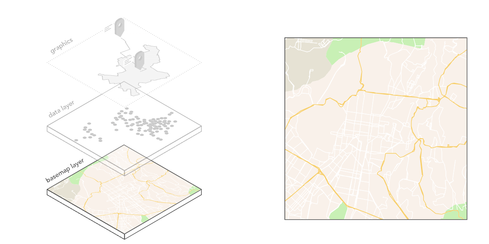
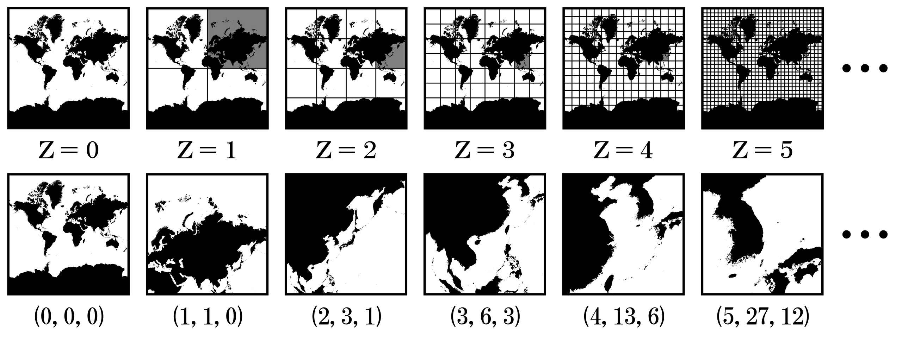

# Mapping in JavaScript

---

## Today

- Discuss types of maps & appropriate library choices.
- Explore examples in D3, Leaflet, and MapLibreGL.

---

## Which Tool?

**What kind of map?**

Abstract/geometric representation of data.

D3 will provide the most flexibility & can use existing tools for color scales/interactivity/etc.

---

## Map w/ Cartographic Features

A different library will be necessary. Depending on needs **raster** or **vector** tiles.

---

## Choropleths in D3

<https://d3-graph-gallery.com/graph/choropleth_basic.html>

### Projection

<https://d3-graph-gallery.com/graph/backgroundmap_changeprojection.html>

---

## Leaflet and MapLibreGL Choropleths

- Projection choice constrained by tile layers.
- Need additional libraries (or pure JS) for interactivity & other graphics.

Demo/Tutorial: <https://leafletjs.com/examples/choropleth/>

---

## Base Maps

Instead of starting with a blank slate, it can be helpful to have a base map, but a base map is often comprised of many feature layers:

- Country/Ocean borders
- National Sub-divisions
- Roads
- Terrain
- Points of Interest
- ...

Drawing all of these layers adds up.

--- 

## Raster Tiles

An innovation that made web mapping scalable in the mid-2000s was pre-rendering base layers into image tiles.

---

## Raster Tiles

### Pros

- Simple to serve: just a lot of images.
- Each image at a zoom level ~approx same size.
- 100% consistent rendering.
- Any kind of imagery (watercolor, satellite maps, etc.)
- Minimal client-side processing needed.
- Good for dense data.

---

### Cons

- Fixed zoom levels and projection.
- Large file sizes for large Z.
- Need to create variants for all desired permutations of features.
- No modifications to styling after the fact.

---

## Vector Tiles

Instead of images, data is sent as images.

- Can create multiple variations per JSON, change road colors/etc without regenerating millions of images.
- Can be more efficient on bandwidth.
- Significantly more complexity on client and server side.
- Older devices may struggle to render them.
- Rendering relies on client library, can vary.
- Not suitable for dense data such as satellite imagery.

Blog Post from *today* on OSM switch to Vector tiles: <https://tech.marksblogg.com/osm-mvt-vector-tiles.html>

---

## Leaflet 

**Raster Tiles w/ Vector Layer on Top**

<https://leafletjs.com/reference.html>

(Has plugins to use Vector Tiles via MapLibreGL)

---

## MapLibreGL

Vector-tile based library. Community fork of MapboxGL.

Mapbox is an innovator in the space, but also quite expensive.

MaplibreGL/MapboxGL are mostly compatible.

---

## General Workflow

- Use library to render map(s) to div(s) on page.
- Pick base layer, either raster or vector.
    - If vector, possibly apply additional styling to base.
- Add additional vector layers based on your data & its features.
- Attach event handlers for interactivity on your features and/or input elements adjacent to the map.

---

## Pop-ups

Leaflet/MapLibre offer a simple API for adding pop-ups to features.

Reminder: hover/pop-up alone is **not enough interactivity** for final product.

---

## Examples

Leaflet & MapLibre examples

---

## Custom Base Layers

- [Stadia Maps Hosted Tiles](https://stadiamaps.com/products/map-tiles/), free for noncommercial/academic use. You will need an account though.
- [OpenMapTiles](https://openmaptiles.org/styles/) - free, meant for self hosting.
- [Mapbox](https://www.mapbox.com) - another paid solution, $$$.

---

## Other Libraries

- [Deck.gl](https://deck.gl) - Alternative renderer similar to Map*GL. TypeScript/React focused mostly, hard to use with JS we covered.
- [OpenLayers](https://openlayers.org) - 
- [Cesium](https://cesium.com) - 3D-focused geospatial.
    - Note: You can also get 3D rendering w/ D3 or MapLibreGL.

---

## More Examples

- <https://projects.fivethirtyeight.com/redistricting-maps/alabama/#Competitive>
- <https://projects.fivethirtyeight.com/partisan-gerrymandering-north-carolina/>
