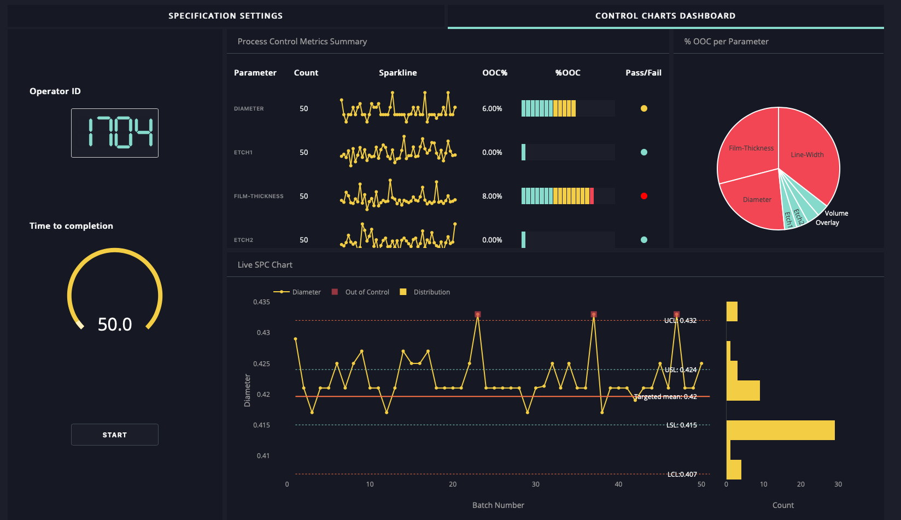

# Data Visualization for Public Policy

## Miscellaneous Odds & Ends

---

## This Week

- Project Questions / Deployment
- Code Quality & Style
- Dashboards
- Visual Style Guides
- 100 Visualizations
- Animation & Interaction

---

## Code Quality

When you are writing a data pipeline or application, code quality is of high importance.

- Readability & Documentation => easier maintenance & bugs prevented.
- Small speed-ups from better algorithm/data structure choices can make big differences when that task executes millions of times.
- Test coverage makes refactoring easier, prevents regressions.

---

### Unique Considerations for Data Viz

- Typically little to no ongoing reuse/maintenance.
- Visualization itself unlikely to be performance bottleneck compared to data manipulation.
- Focus is on **immediate visual output**, testing de-emphasized.
- Often written by solo developer, even in larger organizations.

Code quality still matters, but your main goal should be code that you can trust is correct. Testing, documentation, and the "right way" are less essential.

---


## Dashboards



Long-lived data visualizations that typically run against a central repository of data.

You can use the same techniques & tools, or custom dashboard-focused tools like Tableau or Dash.

Key difference: You will likely need some degree of dynamic refresh (instead of loading CSV/JSON load data from DB/API). Comes with caching and other performance considerations.

---

## Dashboard Psuedocode

```
every interval {
    data = update()
    visualize(data)
}
```

Can make use of animation to provide context:

- scrolling time series
- animated dials to show directional changes

---

## Are Dashboards Bad?

Dashboards saw a surge in popularity a decade or so ago, and there are now plenty of bad dashboards out there.

Golden rule of dashboards: **answer a question & make them actionable**.

Too often people just throw all their data on a dashboard.

*OK, I can see that 6 errors occurred in the last 24 hours...*

- Is that a lot? **Show trends where appropriate!**
- What can I do? **Provide links/action items!**

Without this focus, dashboards become decorations.

---

## Style Guide

It can be helpful to create or build from a style guide. Even for your own work.

Examples: 

- [Sunlight Foundation](https://www.amycesal.com/portfolio#/data-visualization-style-guidelines/)
- [CFPB](https://www.amycesal.com/portfolio#/cfpb-design-manual-data-visualization/)

---

## Key Elements

### Typography

Select 2 complementary fonts:

- Prefer a very legible sans-serif font for data/axes labels.
- Any legible font for chart titles/narrative/etc.

### Color Selection

Best to have:

- Nominal data: Distinct, contrasting hues
- Quantitative data: Linear or divergent gradients
- Consider color-blindness and accessibility

---

## Style Guide: Chart Selection
- Match chart type to **data characteristics** and **audience**.
- Consider:
  - Data dimensionality
  - Comparison needs
  - Narrative goals

---

## Creativity: 1 Dataset 100 Visualizations

<https://100.datavizproject.com>

---

## Applications of Animation

- Demonstrate change over time: Data being added to chart as time "plays."
- Highlight relationships: Hover/highlight/select modifies display of other data on page.
- Focus attention: Show subsets of data at a time.
- Show uncertainty: "wiggle", shifting trend line (next page)

More Examples:
- <https://informationisbeautiful.net>
- <https://www.visualcinnamon.com/portfolio/>


---


---

## Applications of Interaction

- Enable user-driven exploration of data.
    - "How do these two variables compare?"
    - "What happens if this price increases?"
- Allow personalization (e.g. enter your zip code)
    - "What is this like in my city?"
- Increased engagement/retention. Lots of evidence showing we learn best by participating.

---

## JS setInterval

```js
// will call `func` every `everyMS`
let intervalId = setInterval(func, everyMS) 

// stop calling func
clearInterval(intervalId)
```

<https://developer.mozilla.org/en-US/docs/Web/API/Window/setInterval>

---

## Interaction: Making Data Selections

For user-driven data explorations, **selection** is an important concept.

How do you want to let a user select individual records or groups of records?

### Selection Spectrum: Simple to Complex

- Menu/Select Box
- Hover/click on items on page (tooltips, etc.)
- Drag/Region selection
- Pre-written SQL queries with dropdowns/selects. (Common on dashboards.)
- Allow user to write queries themselves in SQL or a custom query language. Common on advanced dashboards.

Altair Selection: <https://altair-viz.github.io/user_guide/interactions.html>
D3 Selection: <https://observablehq.com/collection/@d3/d3-selection>

---

## Discussion: Major Visualization Challenges

- Missing/Incomplete data
- Huge quantities of data
- Complex, high-dimensional data
- Uncertainty
- Challenges of Scale

---

### Missing/Incomplete Data

- Imputation of missing values.
- Label missing data.
- Regardless of choice. Be transparent.

---

### Big Data

- Aggregation
- Sampling
- Filtering/Interactives

---

### Lots of Attributes/Dimensions

- Small multiples approach
- Pairwise charts. (XY, YZ, XZ)
- Advanced: Dimensionality Reduction Algorithms (PCA, TSNE, etc.)
- Interactive exploration

---

### Handling Uncertainty

- Frequency Approach
- Confidence intervals & error bars
- Probabilistic visualizations

---

### Visualizing Scale

- Hierarchical visualizations (treemaps)
- Logarithmic scales when appropriate.
